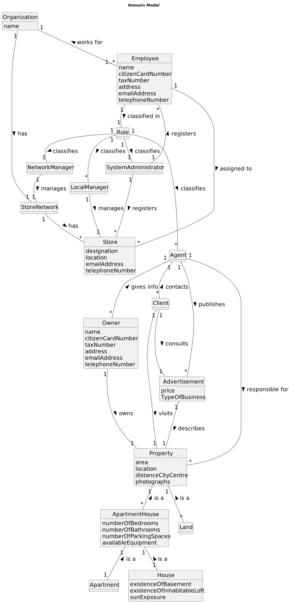

# Analysis

The construction process of the domain model is based on the **_Client_** specifications, especially the nouns (for _concepts_) and verbs (for _relations_) used. 

## Rationale to identify domain conceptual classes ##
To identify domain conceptual classes, start by making a list of candidate conceptual classes inspired by the list of categories suggested in the book "Applying UML and Patterns: An Introduction to Object-Oriented Analysis and Design and Iterative Development". 

### _Conceptual Class Category List_ ###

**Business Transactions**

* Sale, Bought, Rent, Lease

---

**Transaction Line Items**

* Property

---

**Product/Service related to a Transaction or Transaction Line Item**

*  Property, Advertisement

---

**Transaction Records**

*  

---  

**_Roles of People or Organization_**

* Employee, SystemAdmin, NetworkManager, StoreManager, Agent, Client,Owner

---

**Places**

*  Store, StoreNetwork, Property

---

**Noteworthy Events**

* Sale, Bought, Rent, Lease, Visit, Consulting, Registering

---

**Physical Objects**

* Property, Organisation, Stores

---

**Descriptions of Things**

* Advertisement, House, Apartment, Land, ApartmentHouse, Role

---

**Catalogs**

*  

---

**Containers**

*  

---

**Elements of Containers**

*  

---

**_Organization_**

* Real State USA 

---

**Other External/Collaborating Systems**

*  AuthenticationUser

---

**Records of finance, work, contracts, legal matters**

* 

---

**Financial Instruments**

* USD

---

**Documents mentioned/used to perform some work/**

* 
---

###**Rationale to identify associations between conceptual classes**###

An association is a relationship between instances of objects that indicates a relevant connection and that is worth of remembering, or it is derivable from the List of Common Associations: 

+ **_Organization_** has **_StoreNetwork_**
+ **_Employee_** works for **_Organization_**
+ **_Employee_** is assigned to **_Store_**
+ **_Employee_** classified in **_Role_**
+ **_StoreNetwork_** has **_Store_**
+ **_Role_** classifies **_SystemAdministrator_**
+ **_Role_** classifies **_Agent_**
+ **_Role_** classifies **_NetworkManager_**
+ **_Role_** classifies **_LocalManager_**
+ **_SystemAdministrator_** registers **_Store_**
+ **_SystemAdministrator_** registers **_Employee_**
+ **_LocalManager_** manages **_Store_**
+ **_NetworkManager_** manages **_StoreNetwork_**
+ **_Agent_** publishes **_Advertisement_**
+ **_Agent_** is responsible for **_Property_**
+ **_Client_** contacts **_Agent_**
+ **_Client_** consults **_Advertisement_**
+ **_Client_** visits **_Property_**
+ **_Owner_** gives info to **_Agent_**
+ **_Owner_** owns **_Property_**
+ **_Advertisement_** describes a **_Property_**
+ **_Land_** is a **_Property_**
+ **_ApartmentHouse_** is a **_Property_**
+ **_Apartment_** is a **_ApartmentHouse_**
+ **_House_** is a **_ApartmentHouse_**

| Concept (A) 		      |  Association   	  |         Concept (B) |
|---------------------|:-----------------:|--------------------:|
| Organization        |   has     		 	    |        StoreNetwork |
| Employee  	         | works for    		 	 |        Organization |
| Employee            |    assigned to    |               Store |
| Employee            |   classified in   |                Role |
| StoreNetwork        |        has        |               Store |
| Role                |   classified as   | SystemAdministrator |
| Role                |   classified as   |               Agent |
| Role                |   classified as   |      NetworkManager |
| Role                |   classified as   |        LocalManager |
| SystemAdministrator |     registers     |               Store |
| SystemAdministrator |     registers     |            Employee |
| LocalManager        |      manages      |               Store |
| NetworkManager      |      manages      |        StoreNetwork |
| Agent               |     publishes     |       Advertisement |
| Agent               |  responsible for  |            Property |
| Client              |     contacts      |               Agent |
| Client              |     consults      |       Advertisement |
| Client              |      visits       |            Property |
| Owner               |    gives info     |               Agent |
| Owner               |       owns        |            Property |
| Advertisement       |     describes     |            Property |
| Land                |       is a        |            Property |
| ApartmentHouse      |       is a        |            Property |
| Apartment           |       is a        |      ApartmentHouse |
| House               |       is a        |      ApartmentHouse |

## Domain Model

**Do NOT forget to identify concepts attributes too.**

**Insert below the Domain Model Diagram in a SVG format**

