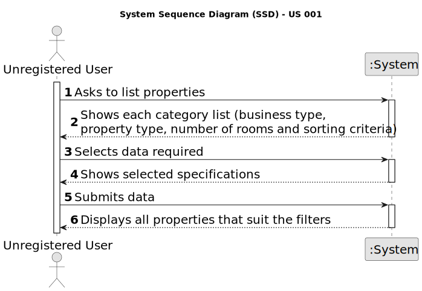

# US 001 - List Properties as an Unregistered User 

## 1. Requirements Engineering

### 1.1. User Story Description

As an unregistered user, I want to display listed properties.

### 1.2. Customer Specifications and Clarifications 

**From the specifications document:**

>	All registered information, except the agency commission, can be accessed by the client who intends to buy or rent the property; the client is, then, responsible for being able to consult the properties by type, number of rooms, and sort by criteria such as price or the parish where the property is located.

**From the client clarifications:**

> **Question:** In the project description it is stated that "the client is, then, responsible for being able to consult the properties by type, number of rooms, and sort by criteria such as price or the parish where the property is located.". Is the client able to sort properties by only these 4 criteria or is he able to sort properties by any of the properties' characteristics?
>  
> **Answer:** The client should be able to select the type of business (renting or buying), the type of property and the number of rooms. Then, the client should be able to sort properties by price or by parish where the property is located.
If the client does not select the type of business, the type of property and the number of rooms, the application should allow the client to sort all properties that are on sale or on renting.

> **Question:** When an unregistered user wants to list properties, the list given by the program is sorted by default with which criteria? For example the list is shown with the properties sorted by most recently added?
>
> **Answer:** Thank you for your suggestion. By default, the list should be shown with the properties sorted by most recently added.

> **Question:** Can a user filter the properties list for example by a type but choosing multiple values? For example the users wants to see only properties with 3 or 4 rooms. If this is possible, after filtering the list to show only the values chosen, he can sort by ascending/descending?
>
> **Answer:** The user should select only one value for each feature of the property. By default, the list should be shown with the properties sorted by most recently added.

> **Question:** The property size, location and type are typed or selected in order to filter the results?
>
> **Answer:** I think you are asking about US1. The client should be able to select (from a list) the type of business, the type of property and the number of rooms.

> **Question:** Can the Client see the list of available houses in all the branches? 
>  
> **Answer:** Yes

> **Question:** The properties can be in sale and lease at the same time?
>
> **Answer:** No
### 1.3. Acceptance Criteria

* **AC1:** The type of business, property type, number of rooms and the sorting method should be defined by the user.

* **AC2** If one of these criteria is not defined, the client must be able to sort all properties following a certain norm.

### 1.4. Found out Dependencies

* There is a dependency to US002. In case a sale announcement is approved, the unregistered user must be able to analyse the new property.

* There is a dependency to US004, because, if that request is accepted, the list of shown properties must include this new one.
### 1.5 Input and Output Data

**Input Data:**

* Typed data:
	* None

* Selected data:
    * Business type
	* Property type
    * Number of rooms
    * How the list is sorted

**Output Data:**

* List of properties currently available for sale and/or lease
* (In)Success of the operation

### 1.6. System Sequence Diagram (SSD)

### 1.7 Other Relevant Remarks
