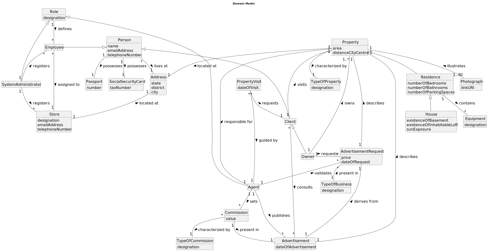

# Analysis

The construction process of the domain model is based on the **_Client_** specifications, especially the nouns (for _concepts_) and verbs (for _relations_) used. 

## Rationale to identify domain conceptual classes ##
To identify domain conceptual classes, start by making a list of candidate conceptual classes inspired by the list of categories suggested in the book "Applying UML and Patterns: An Introduction to Object-Oriented Analysis and Design and Iterative Development". 

### _Conceptual Class Category List_ ###

**Business Transactions**

* Sale
* Purchase
* Rent

---

**Transaction Line Items**

* Property

---

**Product/Service related to a Transaction or Transaction Line Item**

* Property
* Advertisement
* Photograph
* Visit

---

**Transaction Records**

* Property Visit
* Advertisement
* Advertisement Request
---  

**_Roles of People or Organization_**

* Employee
* SystemAdmin
* NetworkManager
* StoreManager
* Agent
* Client

---

**Places**

* Store
* Property

---

**Noteworthy Events**

* Sale of property
* Purchase of property
* Rent of property 
* Visit of property
* Consulting of advertisement 
* Publishing of advertisements
* Registering of employees, stores, advertisements

---

**Physical Objects**

* Property
* Stores
* Passport
* Social Security Card

---

**Descriptions of Things**

* Property
* Advertisement
* Advertisement Request
* Equipment

---

**Catalogs**

*  

---

**Containers**

*  

---

**Elements of Containers**

*  

---

**_Organization_**

* Real State USA 

---

**Other External/Collaborating Systems**

*  AuthenticationUser

---

**Records of finance, work, contracts, legal matters**

* 

---

**Financial Instruments**

* United States Dollar

---

**Documents mentioned/used to perform some work/**

* Applying UML and Patterns An Introduction to Object-Oriented Analysis and Design and Iterative Development, Third Edition, by Craig Larman
---

###**Rationale to identify associations between conceptual classes**###

An association is a relationship between instances of objects that indicates a relevant connection and that is worth of remembering, or it is derivable from the List of Common Associations:

+ **_Agent_** responsible for **_Property_**
+ **_Client_** visits **_Property_**
+ **_Property_** located at **_Address_**
+ **_Owner_** owns **_Property_**
+ **_Photograph_** illustrates **_Property_**
+ **_Advertisement_** describes **_Property_**
+ **_Property_** characterized by **_TypeOfProperty_**
+ **_AdvertisementRequest_** describes **_Property_**
+ **_Residence_** is a **_Property_**

+ **_Client_** requests **_PropertyVisit_**
+ **_PropertyVisit_** guided by **_Agent_**

+ **_House_** is a **_Residence_**
+ **_Residence_** contains **_Equipment_**

+ **_Store_** located at **_Address_**

+ **_Person_** possesses **_Passport_**
+ **_Person_** lives at **_Address_**
+ **_Person_** possesses **_SocialSecurityCard_**
+ **_Employee_** is a **_Person_**
+ **_Client_** is a **_Person_**
+ **_Owner_** is a **_Client_**

+ **_Role_** defines **_Employee_**
+ **_SystemAdministrator_** is a **_Role_**
+ **_Agent_** is a **_Role_**

+ **_Client_** consults **_Advertisement_**

+ **_Owner_** requests **_AdvertisementRequest_**
+ **_Agent_** validates **_AdvertisementRequest_**
+ **_Advertisement_** derives from **_AdvertisementRequest_**

+ **_Employee_** assigned to **_Store_**
+ **_SystemAdministrator_** registers **_Employee_**
+ **_SystemAdministrator_** registers **_Store_**

+ **_Agent_** publishes **_Advertisement_**
+ **_Agent_** sets **_Commission_**

    
+ **_Commission_** characterized by **_TypeOfCommission_**
+ **_Commission_** present in **_Advertisement_**

+ **_TypeOfCommission_** present in **_AdvertisementRequest_**

| Concept (A) 		       |    Association   	    |          Concept (B) |
|----------------------|:---------------------:|---------------------:|
| Agent                | responsible for     	 |             Property |
| Client  	            |      visits    	      |             Property |
| Property             |      located at       |              Address |
| Owner                |         owns          |             Property |
| Photograph           |      illustrates      |             Property |
| Advertisement        |       describes       |             Property |
| Property             |   characterized by    |       TypeOfProperty |
| AdvertisementRequest |       describes       |             Property |
| Residence            |         is a          |             Property |
| Client               |       requests        |        PropertyVisit |
| PropertyVisit        |       guided by       |               Client |
| House                |          is           |            Residence |
| Residence            |       contains        |            Equipment |
| Store                |      located at       |              Address |
| Person               |       possesses       |             Passport |
| Person               |       lives at        |              Address |
| Person               |       possesses       |   SocialSecurityCard |
| Employee             |         is a          |               Person |
| Client               |         is a          |               Person |
| Owner                |         is a          |               Client |
| Role                 |        defines        |             Employee |
| SystemAdministrator  |         is a          |                 Role |
| Agent                |         is a          |                 Role |
| Client               |       consults        |        Advertisement |
| Owner                |       requests        | AdvertisementRequest |
| Agent                |       validates       | AdvertisementRequest |
| Advertisement        |     derives from      | AdvertisementRequest |
| Employee             |      assigned to      |                Store |
| SystemAdministrator  |       registers       |            Employees |
| SystemAdministrator  |       registers       |                Store |
| Agent                |       publishes       |        Advertisement |
| Agent                |         sets          |           Commission |
| Commission           |   characterized by    |     TypeOfCommission |
| Advertisement        |      present in       |           Commission |
| TypeOfBusiness       |      present in       | AdvertisementRequest |

## Domain Model

**Do NOT forget to identify concepts attributes too.**

**Insert below the Domain Model Diagram in an SVG format**

