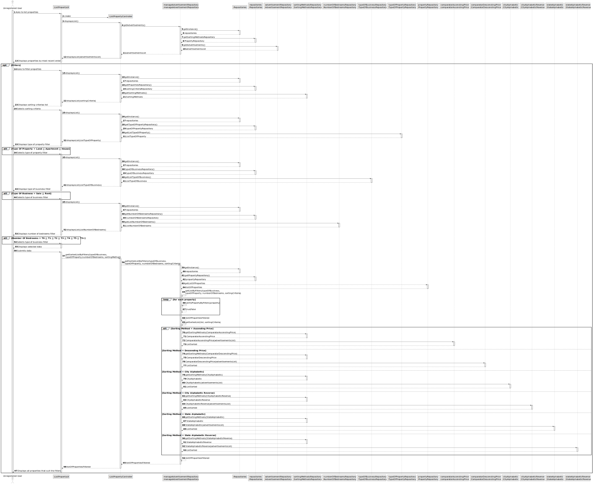
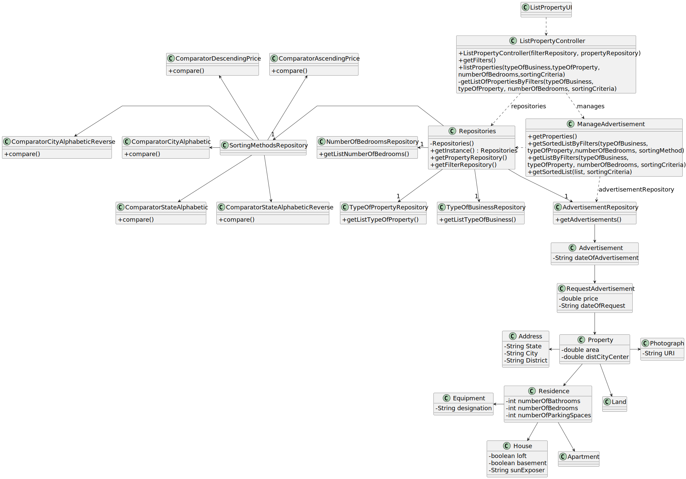

# US 001 - List Properties

## 3. Design - User Story Realization

### 3.1. Rationale

**SSD**

| Interaction ID | Question: Which class is responsible for...              | Answer                        | Justification (with patterns)                                                                                 |
|:---------------|:---------------------------------------------------------|:------------------------------|:--------------------------------------------------------------------------------------------------------------|
| Step 1  		     | 	... interacting with the actor?                         | ListPropertyUI                | Pure Fabrication: there is no reason to assign this responsibility to any existing class in the Domain Model. |
| 			  		        | 	... coordinating the US?                                | ListPropertyController        | Controller                                                                                                    |
| Step 2  		     | 	...knowing the properties by most recent order to show? | ManageAdvertisementRepository | IE: Property filters are contained in the repository.                                                         |
| 		             | 	...knowing the property filters to show?                | FiltersRepository             | IE: Property filters are contained in the repository.                                                         |
|                | 	... displaying the property filters to show?            | ListPropertyUI                | IE: is responsible for user interactions.                                                                     |
| 		             | 	... displaying info?						                              | ListPropertyUI                | IE: has display methods.                                                                                      |
| Step 3  		     | 	...saving the inputted data?                            | Filters                       | IE: object created in step 1 has its own data.                                                                |
|                | 	... saving the selected category?                       | Filters                       | IE: object created in step 1 is classified in one Category.                                                   |
| 			  		        | 	... getting all properties by filters?                  | ManagePropertyRepository      | IE: knows all the Properties.                                                                                 | 
| 			  		        | 	... sorting all properties?                             | ManagePropertyRepository      | IE: knows all the Properties.                                                                                 | 
| Step 8  		     | 	... showing sorted list by filter?                      | ListPropertyUI                | IE: is responsible for user interactions.                                                                     | 

### Systematization ##

According to the taken rationale, the conceptual classes promoted to software classes are:
Property
Residence
Advertisement
AdvertisementRequest
TypeOfBusiness
TypeOfProperty
Address
House
Equipment
Photograph

Other software classes (i.e. Pure Fabrication) identified:
ListPropertyUI
ListPropertyController
ManagePropertyAdvertisement

## 3.2. Sequence Diagram (SD)

### Full Diagram

This diagram shows the full sequence of interactions between the classes involved in the realization of this user story.

### Split Diagram

This diagram shows the same sequence of interactions between the classes involved in the realization of this user story,
but it is split in partial diagrams to better illustrate the interactions between the classes.

It uses interaction occurrence.

## 3.3. Class Diagram (CD)

