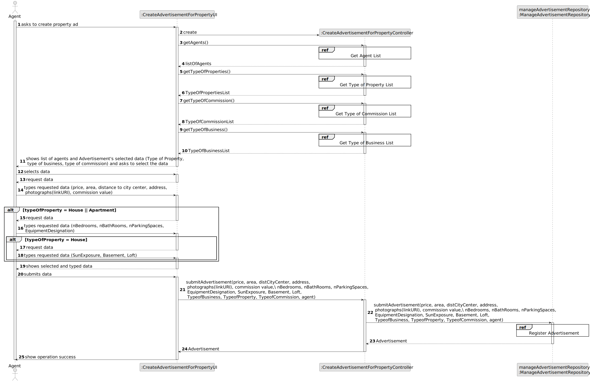
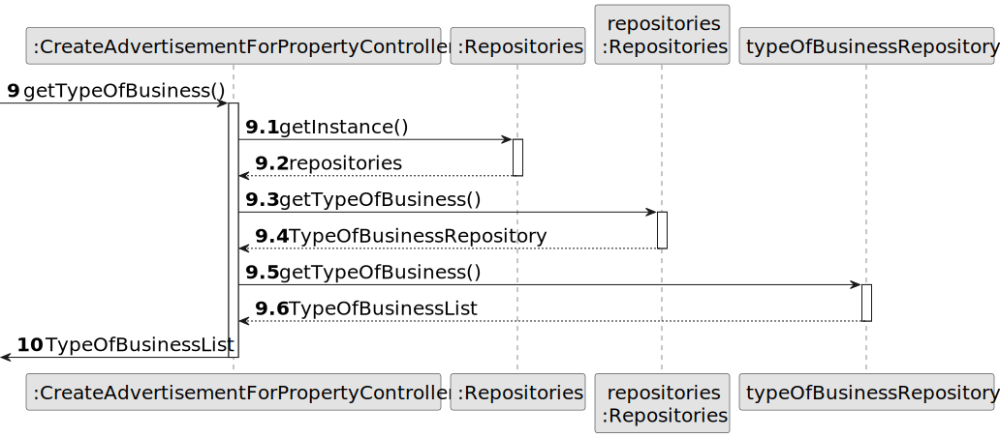

# US 002 - Announce a Sale or Rent

## 3. Design - User Story Realization 

### 3.1. Rationale

**SSD - Alternative 1 is adopted.**

| Interaction ID | Question: Which class is responsible for...         | Answer                                 | Justification (with patterns)                                                                                 |
|:---------------|:----------------------------------------------------|:---------------------------------------|:--------------------------------------------------------------------------------------------------------------|
| Step 1		       | 	... interacting with the agent?                    | MakeAdvertisementForPropertyUI         | Pure Fabrication: there is no reason to assign this responsibility to any existing class in the Domain Model. |
| 			  	         | 	... coordinating the US?                           | MakeAdvertisementForPropertyController | Controller                                                                                                    |
| 			  		        | 	... instantiating a new Advertisement?             | ManageAdvertisementRepository          | IE: ManageRequestRepository has info about Requests.                                                          |
| Step 2         | ... knowing the agent using the system?             | UserSession                            | IE: UserSession has info about agent logged in.                                                               |
|  		     | 	... knowing the property categories to show?						 | FilterRepository                       | IE: Property Categories are contained in the repository.                                                      |
|                | ... knowing the business categories to show?        | FilterRepository                       | IE: Property Categories are contained in the repository.                                                      |
|                | ... knowing the commission categories to show?      | FilterRepository                       | IE: Property Categories are contained in the repository.                                                      |
|                | ... displaying the business categories?             | MakeAdvertisementForPropertyUI         | IE: has display methods.                                                                                      |
|                | ... displaying the comission categories?            | MakeAdvertisementForPropertyUI         | IE: has display methods.                                                                                      |
|                | ... displaying the property categories?             | MakeAdvertisementForPropertyUI         | IE: has display methods.                                                                                      |
|                | ... requesting info?                                | MakeAdvertisementForPropertyUI         | IE: has display methods.                                                                                      |
| Step 3  		     | 	...saving the selected data?                       | Advertisement                          | IE: object created in step 1 has its own data.                                                                |
| Step 4  		     | 	...requesting info?                                | CreateAdvertisementForPropertyUI       | IE: is responsible for user interactions.                                                                     |
| Step 5  		     | 	... saving the typed info?                         | Advertisement                          | IE: object created in step 1 is classified in one Category.                                                   |
| Step 6  		     | 	...displaying the typed and selected data						    | MakeAdvertisementForPropertyUI         | IE: is responsible for user interactions.                                                                     |              
| Step 7			  		  | 	... validating all data (global validation)?       | ManageAdvertisementRepository          | IE: knows all the advertisements.                                                                             | 
| 			  		        | 	... saving the created Advertisement?              | AdvertisementRepository                | IE: owns all the advertisement.                                                                               | 
| Step 8  		     | 	... informing operation success?                   | MakeAdvertisementForPropertyUI         | IE: is responsible for user interactions.                                                                     | 

### Systematization ##

According to the taken rationale, the conceptual classes promoted to software classes are: 

 * Organization
 * Task

Other software classes (i.e. Pure Fabrication) identified: 

 * CreateTaskUI  
 * CreateTaskController

## 3.2. Sequence Diagram (SD)

### Alternative 1 - Full Diagram

This diagram shows the full sequence of interactions between the classes involved in the realization of this user story.

### Alternative 2 - Split Diagram

This diagram shows the same sequence of interactions between the classes involved in the realization of this user story, but it is split in partial diagrams to better illustrate the interactions between the classes.

It uses interaction ocurrence.

**Get Agent List**

**Get Type Of Business List**

**Get Type Of Commission List**

**Get Type Of Property List**

**Register Advertisement**

## 3.3. Class Diagram (CD)

