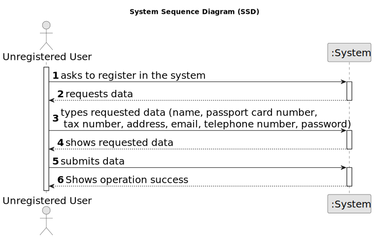

# US 007 - Register new Client

## 1. Requirements Engineering

### 1.1. User Story Description

As an unregistered user, I want to register in the system.

### 1.2. Customer Specifications and Clarifications 

**From the specifications document:**

>	As an unregistered user, I want to register in the system to buy, sell or rent
properties.

**From the client clarifications:**

> **Question:** Does the user also receive the password via email or can he choose a password when registering?
> 
> **Answer:** The owner can choose a password when registering.

> **Question:** When an unregistered user wants to register a new account in the system, the set of parameters that are asked are the following: name, citizen card number, tax number, email, phone number, and password. Do you want any extra parameters/requirements to be asked or just the ones specified above? If so, which ones are mandatory?
> 
>  **Answer:** The Owner attributes are: the name, the citizen's card number, the tax number, the address, the email address and the contact telephone number. The address of the owner is not mandatory.

> **Question:** In a question earlier you presented the owner attributes. Does the client have different attributes?
>
>  **Answer:** A owner is also a client of the Real Estate USA company. The attributes are the same. This distinction between owner and client intends to make an association with the type of business. The Owner sells and provides properties for renting and the client buys and rents properties.
Again, when the user (registered in US7) logins in the system, the user should have access to both owner and client functionalities.

> **Question:** You said that the owner can choose a password, but how many letters, numbers... it needs to have?
>
>  **Answer:** In the Project Description we get: "All those who wish to use the application must be authenticated with a password of seven alphanumeric characters, including three capital letters and two digits". Please read the documentation and clarifications made by the client.

> **Question:** When registering a user, should the application ask if they are registering as a client or an Owner?
>
>  **Answer:** No. When registering a user, in US7, we are registering a user that can buy, sell or rent properties. After registering, when this user logins in the system, the user should have access to both owner and client functionalities.

> **Question:** It was previously stated that an unregistered user could do a property listing request. However, with the introduction of US007, I want to clarify and make sure that now a user needs to be registered in order to buy, sell or rent properties, or if they can still do it unregistered.
>
>  **Answer:** In Sprint B we introduce US7 and now, in US4, the owner needs to be registered in the system to submit a request for listing. You should update all artifacts to include this change.

### 1.3. Acceptance Criteria

* **AC1:** All fields must be filled in with the requested data, apart from the employee address(not to be confused with the email address) which is not mandatory.
* **AC2:** The password associated with the account has to respect the following criteria: seven alphanumeric characters in length, including three capital letters and two digits.
* **AC3:** When registering a user with an already existing reference (email address), the system must reject the operation and the unregistered user must have the chance to retry the given operation.

### 1.4. Found out Dependencies

* There is no dependency between US007 "As an unregistered user, I want to register in the system." and any other US present until now.

### 1.5 Input and Output Data

**Input Data:**

* Typed data:
	* name
    * passport card number (CC) 
    * tax number
    * address
    * email address
    * telephone number
    * password 
	
* Selected data:
	* None so far

**Output Data:**

* (In)Success of the operation

### 1.6. System Sequence Diagram (SSD)

### 1.7 Other Relevant Remarks