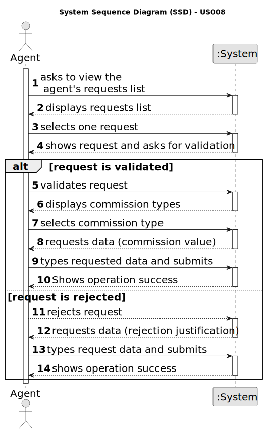

# US 008 - Validate and post an announcement request

## 1. Requirements Engineering

### 1.1. User Story Description

The real estate agent reviews advertisement requests, registers the information in the system and
publishes the offer so that it is visible to all clients who visit the agency and use the application.

### 1.2. Customer Specifications and Clarifications 

**From the specifications document:**

>	As an unregistered user, I want to register in the system to buy, sell or rent
properties.

**From the client clarifications:**

> **Question:** Regarding US008, can the agent decline an announcement request?
> 
> **Answer:** Yes. The agent must include a message justifying the rejection.

> **Question:** Can the agent select multiple requests at the same time?
> 
>  **Answer:** No. The agent can only post one announcement at a time.

> **Question:** When displaying the property announcement requests in the system to the agent besides them being ordered from most recent to oldest is there a need to display the specific day where the requests were published?
> 
>  **Answer:** The list of property announcement requests should be sorted by the date they were created, with the most recent requests appearing first. The system should show the date when the property announcement requests was made.

> **Question:** besides the creation of a message justifiyng the rejection should a message or an email be sent to the client. 
> 
>  **Answer: ** The system should also send the message to the owner by e-mail.

> **Question:** Does the request once its declined by the agent be deleted from the request list?
>
>  **Answer:** The announce request should not be shown again to the agent. We never delete information from our system.

> **Question:** Do the agent have to insert the commission after accepting the request from the request list?
>
>  **Answer:** The agent should, firstly, set the commission and then publishes the offer in the system. The sale price (the USD value that is shown in the announcement) should include the commission value (owner requested price + commission) and should not show the commission. The commission is only specified when the agent accepts the request.

> **Question:** Does the customer have any say in setting the commission (agree or deny, eg: commission too high so I withdraw the ad request) or is the commission solely set by the agent without customer approval?
>
> **Answer:** The agent should, firstly, set the commission and then publishes the offer in the system. The sale price (the USD value that is shown in the announcement) should include the commission value (owner requested price + commission) and should not show the commission. The commission is only specified when the agent accepts the request.

> **Question:** In this US8, will it be necessary to show search criteria? If so, which ones?
>
> **Answer:** There is no search criteria.

### 1.3. Acceptance Criteria

* **AC1:** The list of property announcement requests should be sorted by the date they were created, with the most recent requests appearing first.
* **AC2:** An announcement is posted when a request is accepted. The list of requests should be refreshed, and that request should not be shown again.

### 1.4. Found out Dependencies

* There is a dependency to US004. In case a request is made, the agent, to who it was sent, must be able to view it, in order to see and decide in whether to validate or not the request.

### 1.5 Input and Output Data

**Input Data:**

* Typed data:
	* commission value
    * rejection justification

* Selected data:
	* validation of the request
    * commission type

**Output Data:**

* (In)Success of the operation

### 1.6. System Sequence Diagram (SSD)

### 1.7 Other Relevant Remarks