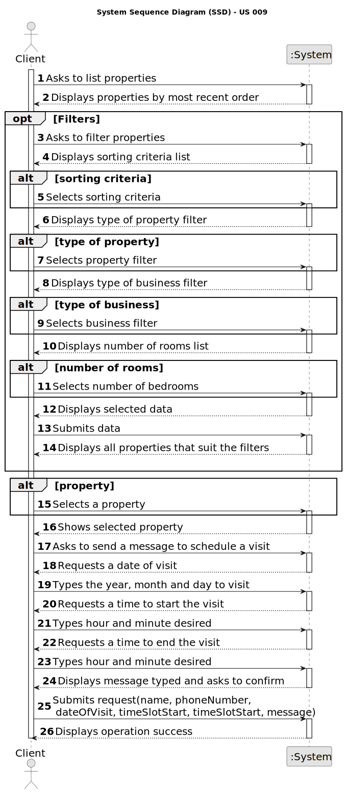

# US 009 - Send a message to schedule a visit 

## 1. Requirements Engineering

### 1.1. User Story Description

As a client, I want to leave a message to the agent to schedule a visit to a property of my interest

### 1.2. Customer Specifications and Clarifications 

**From the specifications document:**

> After consulting a list of properties, the client can request to schedule a visit to the real estate agent
for a specific property to verify its conditions. The agent receives the request, checks the
availability and sends the response. If the customer accepts the order, it is automatically scheduled
in the system.

**From the client clarifications:**

> **Question:** Does the client provide (by typing) their name and phone number for the message, regardless of whether that information is already available to the system? 
>  
> **Answer:** The information available in the system should be used. The client does not need to type the name and phone number.

> **Question:** Is all the required data for the message typed, or is any of it selected?
>  
> **Answer:** For now the information should be typed.

> **Question:** Can the customer visit the same property more than once?
>
> **Answer:** A client may post multiple visit requests, but only if those do not overlap each other. In this US the client is only scheduling a visit to a property. In the beginning of Sprint D we will introduce more USs.

> **Question:** In the message what is the characteristic to identify the property to visit? Can we use the location?
>
> **Answer:** The message should be associated with a property. Please check AC1. The client should select a property that he wants to visit before making the visit request.

> **Question:** In AC2, when the suggestion of date and time is sent, is there a standard duration for the visit or is it mandatory to fill in a start time and an end time for the visit?
>
> **Answer:** There is no standard duration to schedule a visit. The client should define his availability specifying the start time and the end time for the visit.

> **Question:** In AC2, can any time be used or are we limited to certain hours?
>
> **Answer:** Any time can be used.

> **Question:** Also in AC2, should we use the 12am/pm or 24-hour time format?
>
> **Answer:** Please use 24-hour time format.

> **Question:** When we list in another way, should not be possible to have the option to schedule a visit?
>
> **Answer:** After sorting the properties, the client can still schedule a visit.

> **Question:** The client can make multiple schedules in a single message?
>
> **Answer:** Every time the client makes use of this feature of the system, the client can specify multiple date/time slots.

> **Question:** When writing the information to schedule a meeting with the agent, the preferred date and the time slot of the visit should be checked. The client can choose any day of the year? And any time of the day?
>
> **Answer:** Any date and time can be specified. We are always available to our customers!

> **Question:**  Can the client make multiple schedules in a single message for different properties, or can they only have 1 property per message with multiple schedules?
>
> **Answer:** The client can only schedule a visit to one property at a time. Each time the client schedules a visit, the client should specify, for each day, one or multiple time slots. The time slots should not overlap.
If the client wants to visit more properties, the client should use/run again the visit scheduling feature available in the system.
 

### 1.3. Acceptance Criteria

* **AC1:** A list of available properties must be shown, sorted from the most recent entries to the oldest.

 
* **AC2:** The message must also include the client's name, phone number, preferred date and time slot (from x hour to y hour) for the property visit.

* **AC3:** A client may post multiple visit requests, but only if those do not overlap each other.

* **AC4:** The client must receive a success message when the request is valid and registered in the system.

### 1.4. Found out Dependencies

* There is a dependency to "US002 Publish an Advertisement", in order to send a request to visit a property, an announcement must exist

* There is a dependency to "US007 Register new Client" because to be able to schedule a visit, it is necessary to be registered in the system

* There is a dependency to "US008 Validate and post an announcement request", to send visit request, the announcement must be published in the system

### 1.5 Input and Output Data

**Input Data:**

* Typed data:

    * Preferred date
    * Time desired to start the visit
    * Time desired to start the visit

* **Output Data:**

  * (In)Success of the operation

### 1.6. System Sequence Diagram (SSD)

