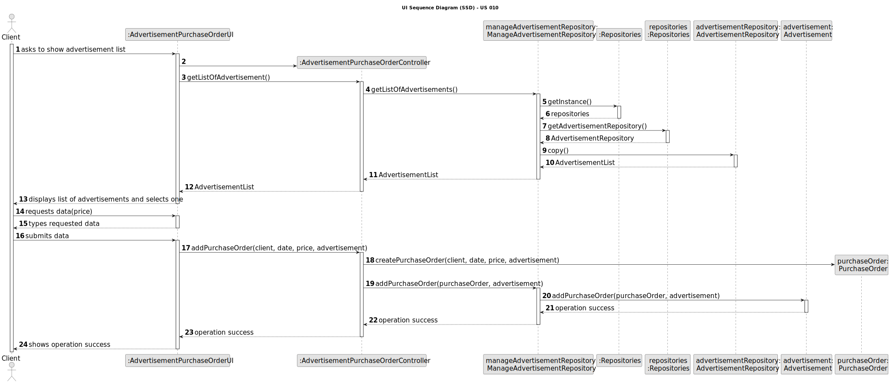
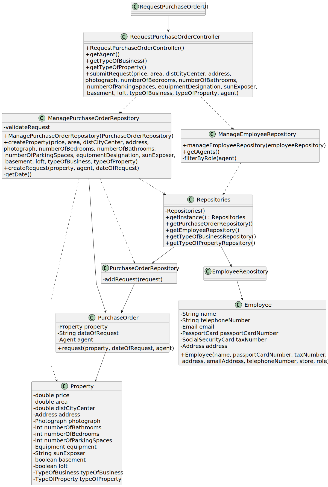

# US 010 - Request Purchase Order

## 3. Design - User Story Realization

### 3.1. Rationale

**SSD**

| Interaction ID | Question: Which class is responsible for...      | Answer                         | Justification (with patterns)                                                                                 |
|:---------------|:-------------------------------------------------|:-------------------------------|:--------------------------------------------------------------------------------------------------------------|
| Step 1  		     | 	... interacting with the owner?                 | RequestAdvertisementUI         | Pure Fabrication: there is no reason to assign this responsibility to any existing class in the Domain Model. |
| 			  		        | 	... coordinating the US?                        | RequestAdvertisementController | Controller                                                                                                    |
| 			  		        | 	... instantiating a new Request?                | ManageRequestRepository        | IE: ManageRequestRepository has info about Requests.                                                          |
| 			  		        | ... knowing the user using the system?           | UserSession                    | IE: cf. A&A component documentation.                                                                          |
| Step 2  		     | 	...knowing the property categories to show?     | PropertyTypeRepository         | IE: Property Categories are contained in the repository.                                                      |
|                | 	... displaying the property categories to show? | RequestAdvertisementUI         | IE: Property Categories are contained in the repository.                                                      |
| 		             | 	... knowing which info to request?						        | RequestAdvertisementUI         | IE: has display methods.                                                                                      |
| 		             | 	... requesting info?						                      | RequestAdvertisementUI         | IE: has display methods.                                                                                      |
| Step 3  		     | 	...saving the inputted data?                    | Request                        | IE: object created in step 1 has its own data.                                                                |
|                | 	... saving the selected category?               | Request                        | IE: object created in step 1 is classified in one Category.                                                   |
| Step 7  		     | 	... validating all data (local validation)?     | Request                        | IE: owns its data.                                                                                            | 
| 			  		        | 	... validating all data (global validation)?    | ManageRequestRepository        | IE: knows all the requests.                                                                                   | 
| 			  		        | 	... saving the created Request?                 | RequestRepository              | IE: owns all its requests.                                                                                    | 
| Step 8  		     | 	... informing operation success?                | RequestAdvertisementUI         | IE: is responsible for user interactions.                                                                     | 

### Systematization ##

According to the taken rationale, the conceptual classes promoted to software classes are:
PurchaseOrder

Other software classes (i.e. Pure Fabrication) identified:
RequestPurchaseOrderUI
RequestPurchaseOrderController

## 3.2. Sequence Diagram (SD)

### Full Diagram

This diagram shows the full sequence of interactions between the classes involved in the realization of this user story.

## 3.3. Class Diagram (CD)

