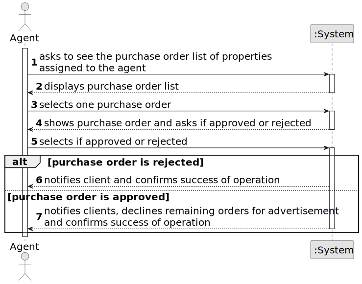

# US 011 - Accept or decline purchase orders

## 1. Requirements Engineering

### 1.1. User Story Description

As an agent, I want to list real estate purchase orders to accept or decline a
purchase order for a property. After accepting or declining, an email notification
should be sent to the customer.

### 1.2. Customer Specifications and Clarifications 

**From the specifications document:**

>	When the client decides to buy/rent the property, he sends a request for the purchase/lease of the
property to the agent. After being appreciated by the agent, he accepts or rejects the order. If the
request is accepted, the offer will not be shown again to clients using the application.

**From the client clarifications:**

> **Question:**  When the agent declines an order, she has to be removed from the list and system?
> 
> **Answer:**  The order should be removed from the list but not from the system.

> **Question:** Regarding US011 should we provide all the property characteristics to assist agents in choosing the appropriate purchase order? If so, is it required to display the amount established by the property owner?
>
> **Answer:** Yes. Yes.

> **Question:** When the agent wants to list real estate purchase orders, does he/she list all of them at once or can a property be chosen to list the purchase orders that are related to that specific property?
>
> **Answer:** The properties should be sorted from the oldest to the most recent one. For each property, the list of purchase orders should be sorted by the amount offered, the highest offer must appear first.

> **Question:** Does grouping purchase orders by property mean that only properties are displayed, and only after a property is selected are its requests shown? Or are all the requests shown but requests of the same property are shown together?
> 
> **Answer:** The system should show (to the agent) a list of properties that have prurchase orders. For each property the system should show a list of purchase orders. Typically we have a small number of purchase orders and we want all orders shown (by property) without selecting a property in particular.

### 1.3. Acceptance Criteria

* **AC1:** The list of purchase orders should be grouped by property. The properties should be sorted from the oldest to the most recent one. For each property, the list of purchase orders should be sorted by the amount offered, the highest offer must appear first.

* **AC2:** For each offer, the agent must be able to accept or decline it. The action of accepting or declining an offer should trigger an email notification to the client.
 

* **AC3:** When a purchase order is accepted, all the other orders should be declined,
  and a message sent to the client.

* **AC4:** If a property does not contain any offers, the system should show an empty list of offers.

### 1.4. Found out Dependencies

*  There is a dependency to "US 003 - Register new Employees" because to be able to accept or decline an offer, it is necessary for the agent to be registered in the system.
*  There is a dependency on "US 0010 - Place an order to purchase a property" because in order to accept or decline an offer, an offer must first be created.

### 1.5 Input and Output Data

**Input Data:**

* Typed data:
    *
* Selected data:
    * Selects if order is rejected or approved

**Output Data:**

* List of existing task categories
* (In)Success of the operation
* Notification for the client in case their offer is declined

### 1.6. System Sequence Diagram (SSD)

### 1.7 Other Relevant Remarks
