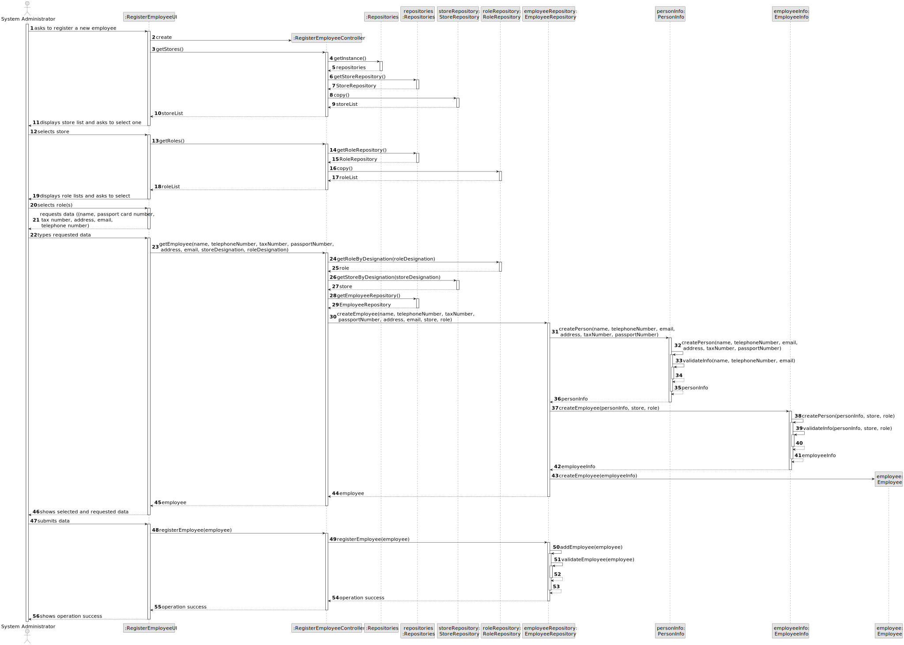
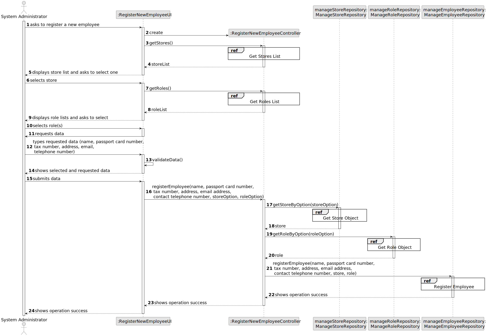
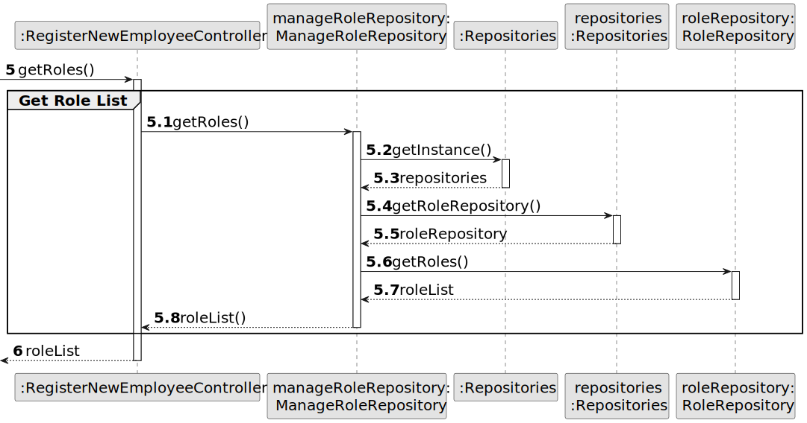
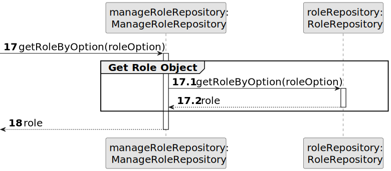
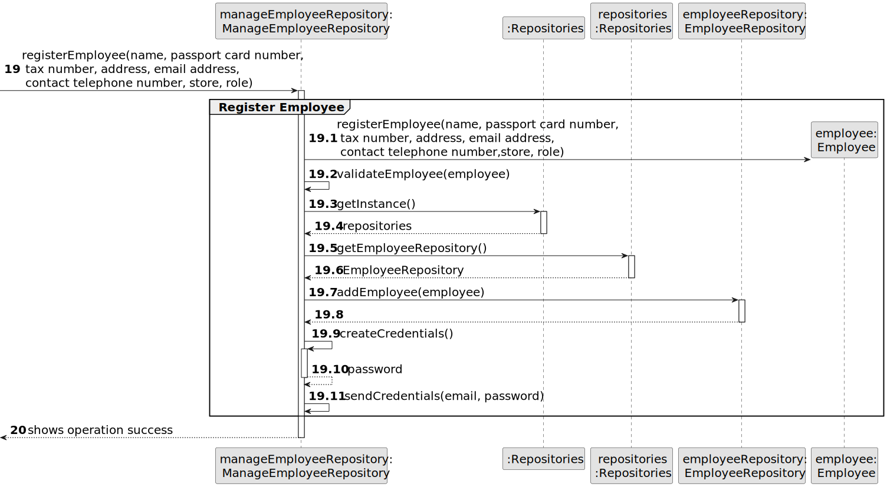
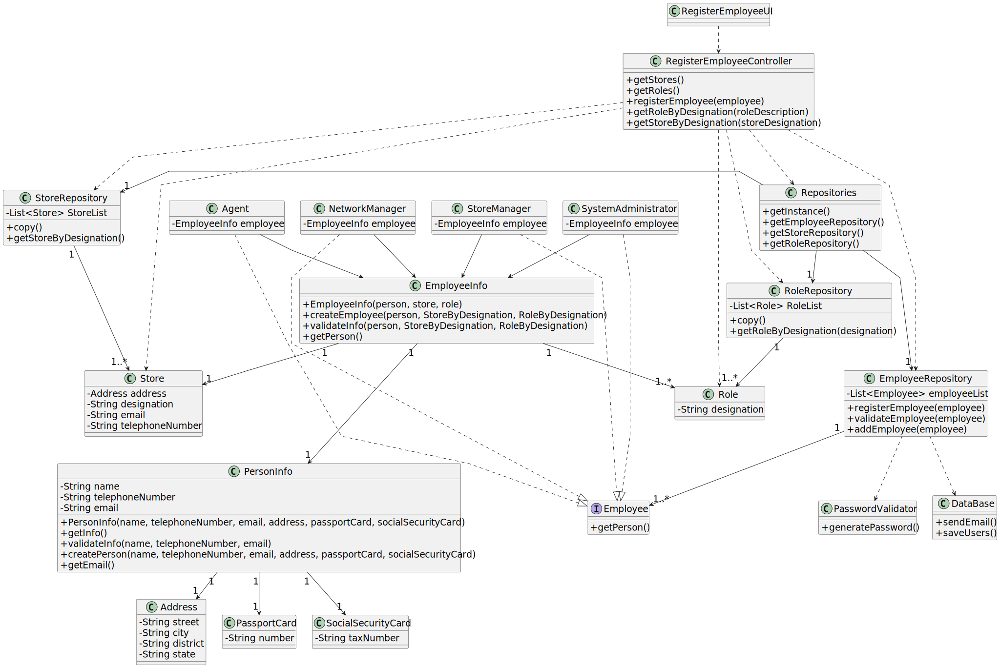

# US 003 - Register new Employees 

## 3. Design - User Story Realization 

### 3.1. Rationale

**SSD.**

| Interaction ID | Question: Which class is responsible for... | Answer                     | Justification (with patterns)                                                                                 |
|:---------------|:--------------------------------------------|:---------------------------|:--------------------------------------------------------------------------------------------------------------|
| Step 1  		     | 	... interacting with the actor?            | RegisterNewEmployeeUI      | Pure Fabrication: there is no reason to assign this responsibility to any existing class in the Domain Model. |
| 			  		        | 	... coordinating the US?                   | RegisterEmployeeController | Controller                                                                                                    |
| 			  		        | 	... instantiating a new Employee?          | ManageEmployeeRepository   | Creator                                                                                                       ||                |                                            |                                             |                                                                                                                     |
| Step 2         | ...knowing the stores to show?              | StoreRepository            | IE: stores are defined by the System Administrator.                                                           |
|                | ...displaying the stores?                   | RegisterNewEmployeeUI      | IE: is responsible for user interactions.                                                                     |
| Step 3  		     | 	...saving the selected store?              | Employee                   | IE: object created in step 1 is associated with a store.                                                      |
| Step 4         | ...knowing the roles to show?               | RoleRepository             | IE: roles are defined by the Administrators.                                                                  |
|                | ...displaying the role(s)?                  | RegisterNewEmployeeUI      | IE: is responsible for user interactions.                                                                     |
| Step 5         | ...saving the selected role(s)?             | Employee                   | IE: object created in step 1 is classified by the role(s).                                                    |
| Step 6         | ...requesting info?                         | RegisterNewEmployeeUI      | IE: is responsible for user interactions.                                                                     |
| Step 7         | ...saving the typed data                    | Employee                   | IE: owns its data.                                                                                            |
| Step 8         | ...displaying the typed and selected data   | RegisterNewEmployeeUI      | IE: is responsible for user interactions.                                                                     |
| Step 9         | ...validating all data (local validation)?  | Employee                   | IE: owns its data.                                                                                            |
|                | ...validating all data (global validation)? | ManageEmployeeRepository   | IE: knows all the employees.                                                                                  |
|                | ... saving the created employee?            | EmployeeRepository         | IE: owns all the employees.                                                                                   |
| Step 10        | ... informing operation success?	           | RegisterNewEmployeeUI      | IE: is responsible for user interactions.                                                                     |

### Systematization ##

According to the taken rationale, the conceptual classes promoted to software classes are: 

 * Employee

Other software classes (i.e. Pure Fabrication) identified: 

 * RegisterNewEmployeeUI
 * RegisterNewEmployeeController
 * ManageEmployeeRepository

## 3.2. Sequence Diagram (SD)

### Alternative 1 - Full Diagram

This diagram shows the full sequence of interactions between the classes involved in the realization of this user story.

### Alternative 2 - Split Diagram

This diagram shows the same sequence of interactions between the classes involved in the realization of this user story, but it is split in partial diagrams to better illustrate the interactions between the classes.

It uses interaction ocurrence.

**Get Role List**

**Get Role Object**

**Get Store List**

**Get Store Object**

**Register Employee**

## 3.3. Class Diagram (CD)

