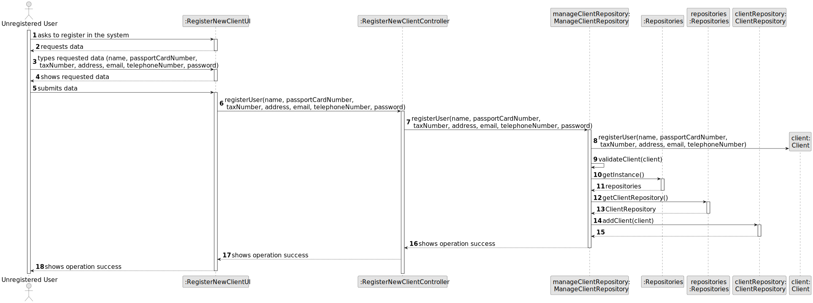
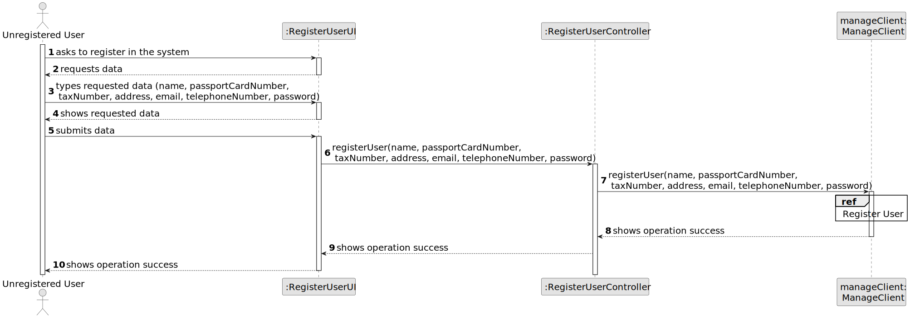
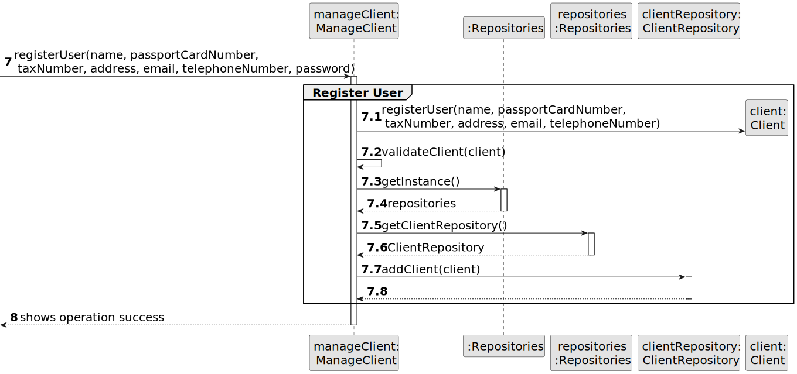
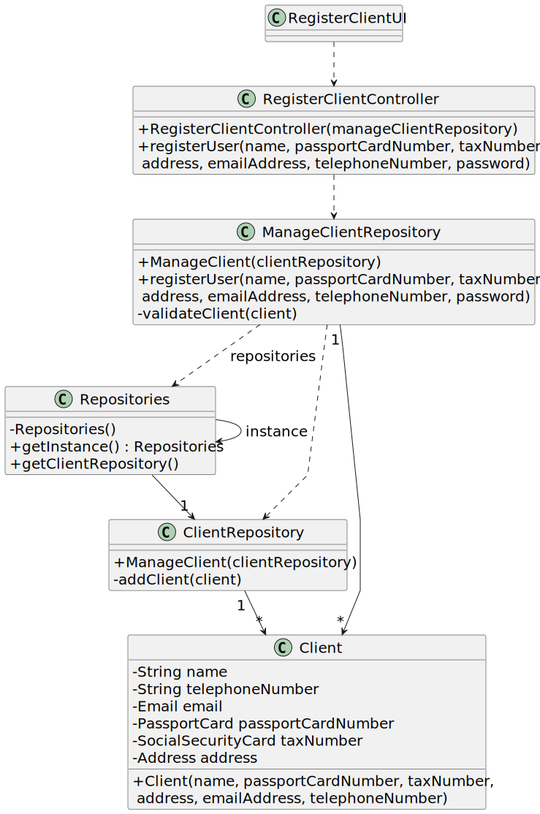

# US 007 - Register new Client 

## 3. Design - User Story Realization 

### 3.1. Rationale

**SSD - Alternative 1 is adopted.**

| Interaction ID | Question: Which class is responsible for... | Answer                   | Justification (with patterns)                                                                                 |
|:---------------|:--------------------------------------------|:-------------------------|:--------------------------------------------------------------------------------------------------------------|
| Step 1  		     | 	... interacting with the actor?            | RegisterClientUI         | Pure Fabrication: there is no reason to assign this responsibility to any existing class in the Domain Model. |
| 			  		        | 	... coordinating the US?                   | RegisterClientController | Controller                                                                                                    |
| 			  		        | 	... instantiating a new Employee?          | ManageClientRepository   | Creator                                                                                                       ||                |                                            |                                             |                                                                                                                     
| Step 2         | ...requesting info?                         | RegisterClientUI         | IE: is responsible for user interactions.                                                                     |
| Step 3         | ...saving the typed data                    | Client                   | IE: owns its data.                                                                                            |
| Step 4         | ...displaying the typed data                | RegisterClientUI         | IE: is responsible for user interactions.                                                                     |
| Step 9         | ...validating all data (local validation)?  | Client                   | IE: owns its data.                                                                                            |
|                | ...validating all data (global validation)? | ManageClientRepository   | IE: knows all the clients.                                                                                    |
|                | ... saving the created client?              | ClientRepository         | IE: owns all the clients.                                                                                     |
| Step 10        | ... informing operation success?	           | RegisterClientUI         | IE: is responsible for user interactions.                                                                     |

### Systematization ##

According to the taken rationale, the conceptual classes promoted to software classes are: 

 * Client

Other software classes (i.e. Pure Fabrication) identified: 

 * RegisterClientUI  
 * RegisterClientController

## 3.2. Sequence Diagram (SD)

### Alternative 1 - Full Diagram

This diagram shows the full sequence of interactions between the classes involved in the realization of this user story.

### Alternative 2 - Split Diagram

This diagram shows the same sequence of interactions between the classes involved in the realization of this user story, but it is split in partial diagrams to better illustrate the interactions between the classes.

It uses interaction occurrence.

**Get Task Category List Partial SD**

## 3.3. Class Diagram (CD)

