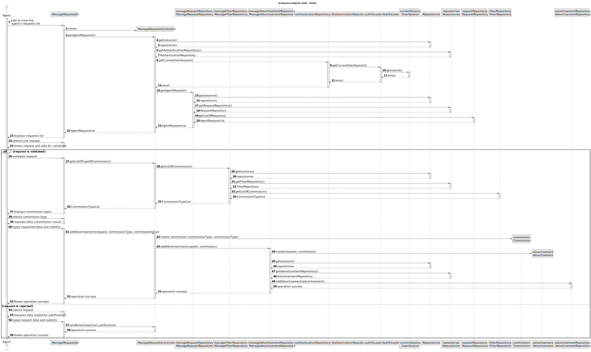
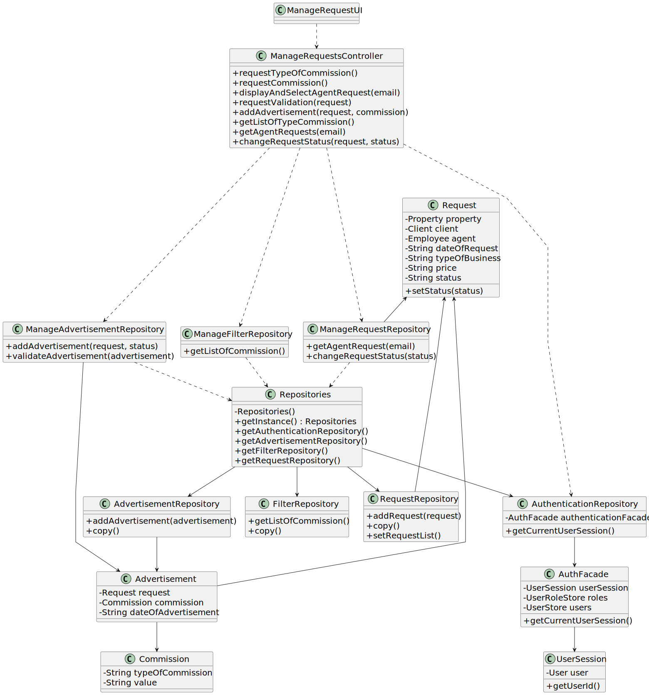

# Validate and post an announcement request 

## 3. Design - User Story Realization 

### 3.1. Rationale

**SSD - Alternative 1 is adopted.**

| Interaction ID | Question: Which class is responsible for...   | Answer                        | Justification (with patterns)                                                                                 |
|:---------------|:----------------------------------------------|:------------------------------|:--------------------------------------------------------------------------------------------------------------|
| Step 1  		     | 	 ... interacting with the actor?             | ManageRequestsUI              | Pure Fabrication: there is no reason to assign this responsibility to any existing class in the Domain Model. |
|                | ... coordinating the US?                      | ManageRequestsController      | Controller: Controls the sequence of events                                                                   |
|                | ... instantiating a new Advertisement?        | ManageAdvertisementRepository | Creator : ManageAdvertisementRepository is responsible for creating an advertisement                          |
| Step 2         | ... knowing the requests to show?             | RequestRepository             | IE: requests are defined by the clients.                                                                      |
|                | ... displaying the Agent requests?            | ManageRequestsUI              | IE: is responsible for user interactions.                                                                     |
| Step 3         | ... saving the selected request?              | Advertisement                 | IE:  object created in step 1 is associated with a request.                                                   |
| Step 4         | ... displaying the request?                   | ManageRequestsUI              | IE: is responsible for user interactions.                                                                     |
| Step 5         | ... changing the request status to validated  | Request                       | IE: is responsible for its owns data                                                                          |
| Step 6  		     | 	... knowing the types of commission to show? | FilterRepository              | IE: types of commission are defined by the system administrator.                                              |
|                | ... displaying the types of commission?       | ManageRequestsUI              | IE: is responsible for user interactions.                                                                     |
| Step 7  		     | ... saving the selected type of commission?	  | Commission                    | IE:  Commission is classified in one Type.                                                                    |
| Step 8  		     | ...requesting info?	                          | ManageRequestsUI              | IE: is responsible for user interactions.                                                                     |
|                | ... saving the typed commission value?        | Commission                    | IE:  Commission is classified by a value.                                                                     |
| Step 9  		     | 	... saving the created advertisement?        | AdvertisementRepository       | IE: owns all the advertisements.                                                                              |
| Step 10  		    | ... informing operation success? 	            | ManageRequestsUI              | IE: is responsible for user interactions.                                                                     |
| Step 11  		    | 	... changing the request status rejected     | Request                       | IE: is responsible for its owns data                                                                          |
| Step 12  		    | 	...requesting info?                          | ManageRequestsUI              | IE: is responsible for user interactions.                                                                     |
| Step 13        | ... saving the rejection justification        | ManageRequestController       | IE: the rejection justification will be attributed to a variable                                              |
| Step 14        | ... informing operation success?              | ManageRequestsUI              | IE: is responsible for user interactions.                                                                     |

### Systematization ##

According to the taken rationale, the conceptual classes promoted to software classes are: 

 * Request
 * Advertisement
 * Commission
 * Commission Type

Other software classes (i.e. Pure Fabrication) identified: 

 * ManageRequestsUI
 * ManageRequestsController
 * AdvertisementRepository
 * FilterRepository
 * RequestRepository
 * ManageAdvertisementRepository

## 3.2. Sequence Diagram (SD)

### Alternative 1 - Full Diagram

This diagram shows the full sequence of interactions between the classes involved in the realization of this user story.

## 3.3. Class Diagram (CD)

