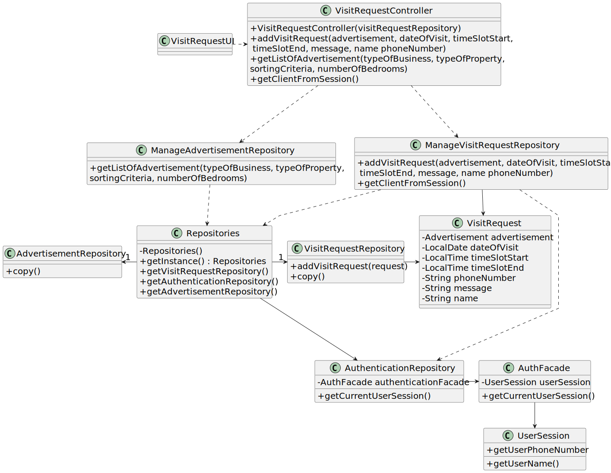

# US 009 - Send a message to schedule a visit

## 3. Design - User Story Realization 

### 3.1. Rationale

**SSD - Alternative 1 is adopted.**

| Interaction ID | Question: Which class is responsible for...           | Answer                        | Justification (with patterns)                                                                                 |
|:---------------|:------------------------------------------------------|:------------------------------|:--------------------------------------------------------------------------------------------------------------|
| Step 1  		     | 	... interacting with the actor?                      | VisitRequestUI                | Pure Fabrication: there is no reason to assign this responsibility to any existing class in the Domain Model. |
| 			  		        | 	...  coordinating the US?                            | VisitRequestController        | Controller : Controls the sequence of events                                                                  |
| Step 2  		     | 		...displaying the list of advertisements					       | VisitRequestUI                | IE: is responsible for user interactions.                                                                     |
| Step 3  		     | 	...knowing the user wants to filter the list?        | VisitRequestUI                | IE: is responsible for user interactions.                                                                     |
| Step 4  		     | 	...displaying the list of sorting criteria?          | VisitRequestUI                | IE: is responsible for user interactions.                                                                     |
| 		             | 	...knowing which filter needs to be listed?          | ManageFilterRepository        | IE:  owns all its filters.                                                                                    |
| Step 5  		     | 	...knowing which filter the user selected?           | SortingCriteria               | IE: Sorting criteria is classified in one type.                                                               |
| Step 6  		     | 	...displaying the list of types of property?         | VisitRequestUI                | IE: is responsible for user interactions.                                                                     |
| 		             | 	...knowing which filters needs to be listed?         | ManageFilterRepository        | IE:  owns all its filters.                                                                                    |
| Step 7  		     | 	...knowing which filter the user selected?           | TypeOfProperty                | IE: Type of property is classified in one type.                                                               |
| Step 8  		     | 	...displaying the list of types of business?         | VisitRequestUI                | IE: is responsible for user interactions.                                                                     |
| 		             | 	...knowing which filter needs to be listed?          | ManageFilterRepository        | IE:  owns all its filters.                                                                                    |
| Step 9  		     | 	...knowing which filter the user selected?           | TypeOfBusiness                | IE: Type of property is classified in one type.                                                               |
| Step 10  		    | 	...displaying the list of number of bedrooms?        | VisitRequestUI                | IE: is responsible for user interactions.                                                                     |
| 		             | 	...knowing which filter needs to be listed?          | ManageFilterRepository        | IE:  owns all its filters.                                                                                    |
| Step 11  		    | 	...knowing which filter the user selected?           | NumberOfBedrooms              | IE: Type of property is classified in one type.                                                               |
| Step 12  		    | 	...knowing which filters were selected?              | ManageFilterRepository        | IE: owns all the filter's information.                                                                        |
| 		             | 	...displaying the selected data?                     | VisitRequestUI                | IE: is responsible for user interactions.                                                                     |
| Step 13  		    | 	... saving the filters selected?                     | ManageFilterRepository        | IE: owns all the filter.                                                                                      | 
| 		             | 	... filter the list of advertisements?               | ManageAdvertisementRepository | IE: owns all the advertisements.                                                                              | 
| Step 14  		    | 	...displaying the list that suit the filters?        | VisitRequestUI                | IE: is responsible for user interactions.                                                                     |
| Step 15  		    | 	...knowing which advertisement was selected?         | ManageAdvertisementRepository | IE: owns all the advertisements.                                                                              |
| Step 16  		    | 	...displaying the selected advertisement?            | VisitRequestUI                | IE: is responsible for user interactions.                                                                     |
| Step 17 		     | 	...knowing that the user wants to send a message?    | VisitRequestUI                | IE: is responsible for user interactions.                                                                     | 
| Step 18  		    | 	... requesting the date of the visit?                | ManageVisitRequest            | IE: owns all the information's request.                                                                       | 
| 	Step 19	      | 	... saving the date of the visit?                    | VisitRequestRepository        | IE: is classified by a date of visit.                                                                         | 
| Step 20  		    | 	... requesting the time to start the visit?          | ManageVisitRequest            | IE: owns all the request's information.                                                                       | 
| 	Step 21	      | 	... saving the time to the start the visit?          | VisitRequestRepository        | IE: is classified by a time for starting the visit.                                                           | 
| Step 22  		    | 	... requesting the time to the end the visit?        | ManageVisitRequest            | IE: owns all the request's information.                                                                       | 
| 	Step 23	      | 	... saving the time to end the visit?                | VisitRequestRepository        | IE: is classified by a time for ending of the visit.                                                          | 
| Step 24  		    | 	...displaying the message?                           | VisitRequestUI                | IE: is responsible for user interactions.                                                                     |
| 		             | 	...knowing the personal information for the message? | Person                        | IE: owns all the personal's information.                                                                      |
| 		             | 	...knowing the information about the message?        | ManageVisitRequest            | IE: owns all the information's request.                                                                       |
| 		             | 	...knowing that the user confirmed the message?      | VisitRequestUI                | IE: is responsible for user interactions.                                                                     |
| 	Step 25	  		  | 	... instantiating a new visit request?               | ManageVisitRequest            | Creator : ManageVisitRequest is responsible for creating a visit request.                                     |
| 	 	  		        | 	... saving the new visit request ?                   | VisitRequestRepository        | IE: owns all the visit requests.                                                                              |
| Step 26  		    | 	... informing operation success?                     | VisitRequestUI                | IE: is responsible for user interactions.                                                                     | 

### Systematization ##

According to the taken rationale, the conceptual classes promoted to software classes are:

* Person
* VisitRequest
* Client
* Agent
* Advertisement

Other software classes (i.e. Pure Fabrication) identified: 

 * VisitRequestUI  
 * VisitRequestController
 * ManageVisitRequest
 * ManageAdvertisement

## 3.2. Sequence Diagram (SD)

### Full Diagram

This diagram shows the full sequence of interactions between the classes involved in the realization of this user story.

## 3.3. Class Diagram (CD)

