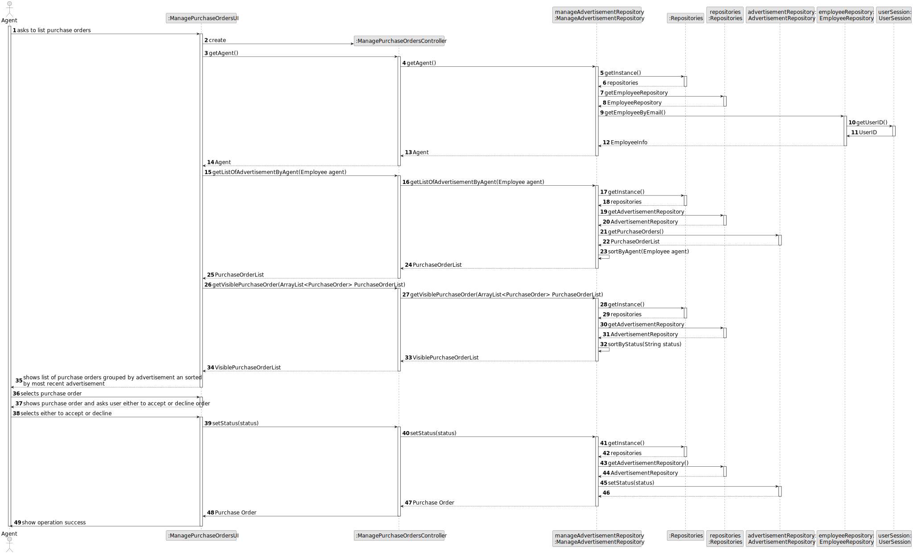
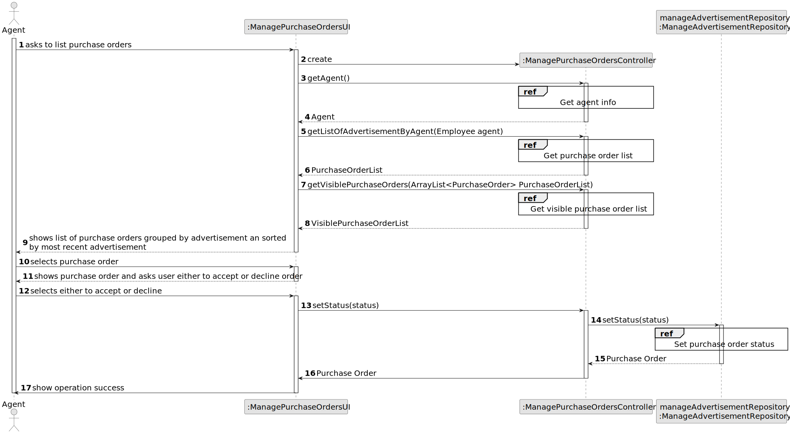
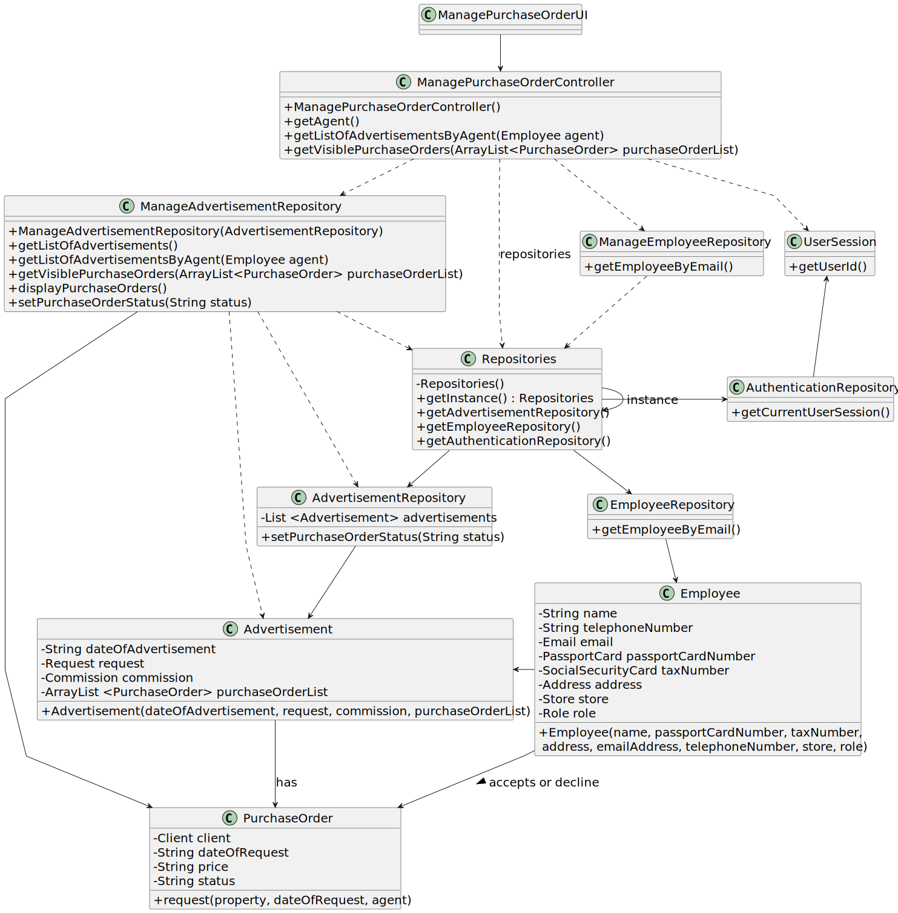

# US 011 - Accept or decline purchase orders

## 3. Design - User Story Realization 

### 3.1. Rationale

**SSD - Alternative 1 is adopted.**

| Interaction ID | Question: Which class is responsible for...    | Answer                         | Justification (with patterns)                                                                                 |
|:---------------|:-----------------------------------------------|:-------------------------------|:--------------------------------------------------------------------------------------------------------------|
| Step 1  		     | 	... interacting with the actor?               | ListPurchaseOrdersUI           | Pure Fabrication: there is no reason to assign this responsibility to any existing class in the Domain Model. |
| 			  		        | 	... coordinating the US?                      | ListPurchaseOrdersController   | Controller                                                                                                    |
| 			  		        | 	... instantiating a new purchase order?       | PurchaseOrdersRepository       | IE: ManageRequestRepository had info about purchase orders.                                                   |
| Step 2		  		   | ... knowing the agent using the system?        | UserSession                    | IE: UserSession has info about agent logged in.                                                               |
| 			  		        | ... knowing the purchase order to list?						  | PurchaseOrdersRepository       | IE: Purchase orders are contained in this repository.                                                         |
| 			  		        | ... displaying the purchase orders list?						 | ListPurchaseOrdersUI           | IE: has display methods.                                                                                      |
|                | ...displaying info?                            | ListPurchaseOrdersUI           | IE: has display methods.                                                                                      |
| Step 3  		     | 	...saving the selected data?                  | Utils                          | IE: Utils has method for selecting data.                                                                      |
| Step 4  		     | 	...getting the selected purchase order?       | PurchaseOrdersRepository       | IE: knows all purchase orders.                                                                                |
| Step 6		       | 	... showing the purchase order?               | ListPurchaseOrdersUI           | IE: is responsible for user interactions.                                                                     |
| Step 6         | ... requesting selection                       | ListPurchaseOrdersUI                                | IE: is responsible for user interactions.                                                                                                              |
| Step 7  		     | 	... validating all data (global validation)?  | ManagePurchaseOrdersRepository | IE: knows all purchase orders.                                                                                | 
| 			  		        | 	... saving the changed purchase order status? | PurchaseOrdersRepository       | IE: owns all purchase orders.                                                                                 | 
| Step 8  		     | 	... informing operation success?              | ListPurchaseOrdersUI           | IE: is responsible for user interactions.                                                                     | 

### Systematization ##

According to the taken rationale, the conceptual classes promoted to software classes are: 

 * Organization
 * Task

Other software classes (i.e. Pure Fabrication) identified: 

 * CreateTaskUI  
 * CreateTaskController

## 3.2. Sequence Diagram (SD)

### Alternative 1 - Full Diagram

This diagram shows the full sequence of interactions between the classes involved in the realization of this user story.

### Alternative 2 - Split Diagram

This diagram shows the same sequence of interactions between the classes involved in the realization of this user story, but it is split in partial diagrams to better illustrate the interactions between the classes.

It uses interaction ocurrence.

**Get Task Category List Partial SD**

**Get Task Category Object**

**Get Employee**

**Create Task**

## 3.3. Class Diagram (CD)

