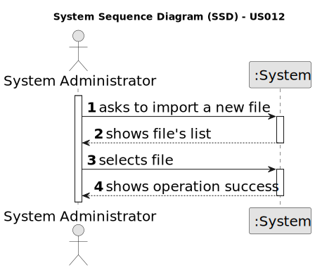

# US 012 - Import information common in others agencies

## 1. Requirements Engineering

### 1.1. User Story Description

As a system administrator, I want to import information from a legacy
system that has been in use in several agencies.

### 1.2. Customer Specifications and Clarifications 

**From the specifications document:**

>

**From the client clarifications:**

> **Question:** Can the System Administrator, when wanting to import information from a legacy system, send more than one file at once?
>  
> **Answer:** Only one file at a time.

> **Question:** In the CSV containing the data from the legacy system, properties classified as Apartment have themselves a value for Sun Exposure. However, the specification document describes this attribute as exclusive to the property type House: "In case the property is a house, the existence of a basement, an inhabitable loft, and sun exposure must be registered as well.". Do we add Sun Exposure to the apartment's attributes or does it stay exclusive to house?
>
> **Answer:** When loading an apartment from the legacy system (from the CSV file) you should ignore the attribute Sun Exposure.
The CSV file contains data exported from a legacy system. The legacy system does not register the same information that the system that you are developing now registers. For instance, the legacy system does not associate an agent to a property, therefore, when importing data from a legacy system you should create an agent/employee having:
name=Legacy Agent; passport card number=000000000; tax number=000000000, email address=legacy@realstateUSA.com; contact telephone number = 0000000000; and associate this "legacy agent" with each property (make it the property responsible agent). Moreover, you should prepare your system to accept two formats for the passport number, one with 9 numbers and the other starts with the letter C followed by eight numbers.

> **Question:** From the provided CSV file, our team infers that this feature is meant to import data related to announcements only and not other data like, for example, employee information. Is this correct?
>
> **Answer:** The new system should allow the System Administrator to import CSV files like the one provided in moodle. The legacy system is not able to export any other fields/attributes or formats.

> **Question::** In the project description and the previous US's it is stated that the area (and distance from the city center) of a property must be in meters (or m^2), however in the legacy file the measuring system used in the area is feet (the distance is also in miles) instead.
As such, do we need to convert the data into meters when we are importing the file information or do we just import the data and pretend it is in meters for the purposes of the application?
>
> **Answer:** There is no need to convert the area and distances metrics. Both in the legacy system and in the system that we are developing now, the area should always be measured in feet and the distance in miles.

> **Question::** Are we only expected to read address with those formats or will there be address with other formats?
>
> **Answer:** You should only consider address formats that can be seen in the two CSV files that were made available in moodle.

> **Question::** Some address are registered with the State  AK, is that a mistake and the State should really be Alaska (AK) or is that intended
>
> **Answer:** All data must be correct and no errors have been deliberately introduced. I checked the file and I only get State AK. Maybe you are opening the CSV file using an application that uses a character encoding that is different from utf-8.

> **Question::** Also, in relation to AC2, can we assume that a CSV file is any file whose filename ends with ".csv"?
>
> **Answer:** The System Administrator should be able to load any file with the extension csv. The file content must be validated, showing a message to the system
administrator if the file is empty or its content is not in the requested format.

### 1.3. Acceptance Criteria

* **AC1:** The system administrator must be able to choose a file to import.

* **AC2:** The system should only accept CSV files.

* **AC3:** The file content must be validated, showing a message to the system administrator if the file is empty or its content is not in the requested format.
 

* **AC4:** The import operation, when successful, should trigger a success message to the system administrator.

### 1.4. Found out Dependencies

* There is no dependency between "US012 : Import information common in others agencies"  and any other US present until now.

### 1.5 Input and Output Data

**Input Data:**

* Typed data:
	* name of the file to be imported

**Output Data:**

* (In)Success of the operation

### 1.6. System Sequence Diagram (SSD)

### 1.7 Other Relevant Remarks

