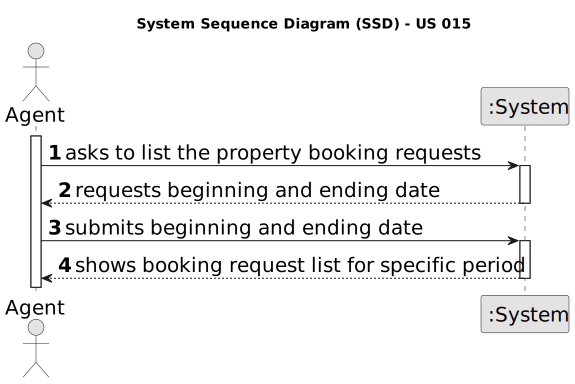

# US 015 - List Booking Requests

## 1. Requirements Engineering

### 1.1. User Story Description

As an agent, I intend to list all booking requests for properties managed by me

### 1.2. Customer Specifications and Clarifications 

**From the specifications document:**

>  After consulting a list of properties, the client can request to schedule a visit to the real estate agent
for a specific property to verify its conditions. The agent receives the request, checks the
availability and sends the response. If the customer accepts the order, it is automatically scheduled
in the system.

**From the client clarifications:**

> **Question:** When the agent requests the booking requests list to contact the client, that list should ONLY contain the requests related to that agent?
>  
> **Answer:** Yes. Listing is a feature described in US15. In US15 the Agent gets a list of booking requests (made to him). Then, the agent, may want to respond to the user (as defined in US16). US15 and US16 are executed sequentially. Even so, the agent should be able to see a list of all booking requests made to him (US15) without answer any booking request.

> **Question::** Booking is a slightly vague word. Our team wants clarifications on what type of requests the word encompasses (visit requests being our strongest guess, but we are not sure).
>
> **Answer:** It is a visit request.

> **Question::** : In US015's AC1, it is stated that "The list of requests must be shown for a specific period (begin date, end date)."
This time period caused confusion, as the team is unsure whether the "date" is referring to the date chosen by the client in the message (See US009's requirements) or the date of creation of the visit request.
>
> **Answer:** The goal is to use the date chosen by the client (the preferred date that you can see in US9) to list booking requests.

> **Question::** US015's AC1 states that "The list of requests must be shown for a specific period (begin date, end date)". As such, our team would like to know if you want this time period to be selected or typed, and in which format it should be in.
>
> **Answer:** The dates should be selected. The format should be DD-MM-YYYY.

 
 
### 1.3. Acceptance Criteria

* **AC1:** . The list of requests must be shown for a specific period (begin date, end date).
* **AC2:**  The list of requests must be sorted by date in ascending order. The sorting
  algorithm to be used by the application must be defined through a configuration
  file. At least two sorting algorithms should be available

  
### 1.4. Found out Dependencies

* There is a dependency to "US003 : Register new Employees" since to list all booking requests, the system administrator must first insert the employee into the system.
* There is a dependency to "US009 : Send a message to schedule a visit" since to list any booking request on the system the client must have been able to beforehand create a booking request.

### 1.5 Input and Output Data

**Input Data:**

* Selected data:
  * Beginning Date
  * Ending Sate

* **Output Data:**

  * (In)Success of the operation

### 1.6. System Sequence Diagram (SSD)

