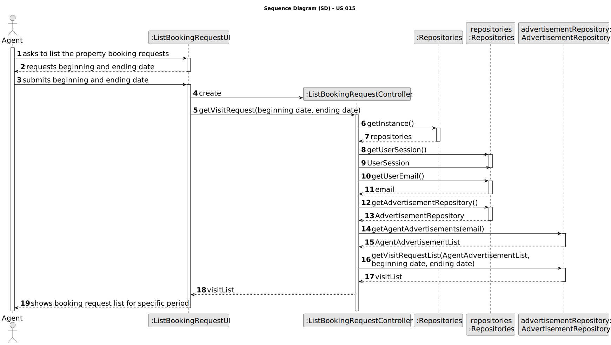
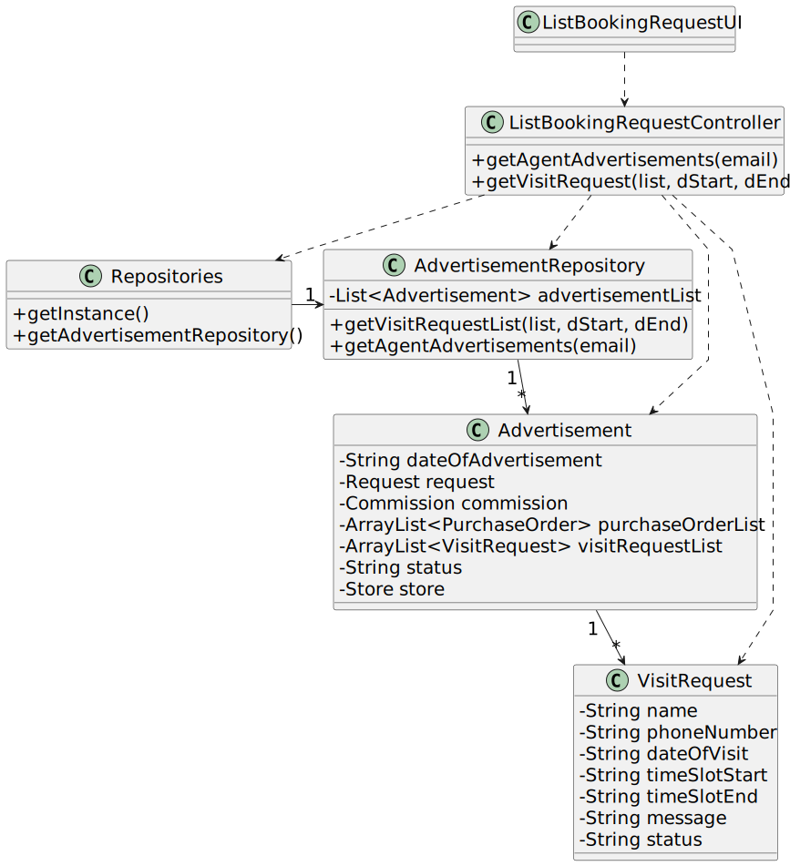

# US 015 - List Booking Requests

## 3. Design - User Story Realization 

### 3.1. Rationale

**SSD - Alternative 1 is adopted.**

| Interaction ID | Question: Which class is responsible for... | Answer                       | Justification (with patterns)                                                                                 |
|:---------------|:--------------------------------------------|:-----------------------------|:--------------------------------------------------------------------------------------------------------------|
| Step 1  		     | 	... interacting with the actor?            | ListBookingRequestUI         | Pure Fabrication: there is no reason to assign this responsibility to any existing class in the Domain Model. |
| 			  		        | 	...  coordinating the US?                  | ListBookingRequestController | Controller : Controls the sequence of events                                                                  |
| Step 2  		     | 		...requesting information?					           | VisitRequestUI               | IE: is responsible for user interactions.                                                                     |
| Step 3  		     | 	...getting the Agent's advertisements?     | AdvertisementRepository      | IE: owns all advertisements and methods to filter them.                                                       |
| 		             | 	...getting the Agent's visit requests?     | AdvertisementRepository      | IE: owns all advertisements and their information, such as the visit requests.                                |
| Step 4  		     | 	...displaying the list of visit requests?  | ListBookingRequestUI         | IE: is responsible for user interactions.                                                                     |

### Systematization ##

According to the taken rationale, the conceptual classes promoted to software classes are:

* VisitRequests
* Advertisement

Other software classes (i.e. Pure Fabrication) identified: 

 * BookingRequestUI  
 * BookingRequestController
 * AdvertisementRepository

## 3.2. Sequence Diagram (SD)

### Full Diagram

This diagram shows the full sequence of interactions between the classes involved in the realization of this user story.

## 3.3. Class Diagram (CD)

