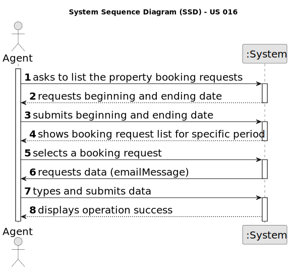

# US 016 - Respond to Booking Requests 

## 1. Requirements Engineering

### 1.1. User Story Description

As an agent, when viewing a booking request, I want to respond to the user
that scheduled the visit.

### 1.2. Customer Specifications and Clarifications 

**From the specifications document:**

>  After consulting a list of properties, the client can request to schedule a visit to the real estate agent
for a specific property to verify its conditions. The agent receives the request, checks the
availability and sends the response. If the customer accepts the order, it is automatically scheduled
in the system.

**From the client clarifications:**

> **Question:** When the agent requests the booking requests list to contact the client, that list should ONLY contain the requests related to that agent?  
>  
> **Answer:** Yes. Listing is a feature described in US15. In US15 the Agent gets a list of booking requests (made to him). Then, the agent, may want to respond to the user (as defined in US16). US15 and US16 are executed sequentially. Even so, the agent should be able to see a list of all booking requests made to him (US15) without answer any booking request.

> **Question:** In this US16, will it be necessary to save the message for could be in future list in the application or for audit action? 
>
> **Answer:** The system should record typed text messages. Regarding other messages, that only use information that is already registered in the system, the system should only record that the message was sent.
> **Question:** Regarding the AC4, it is stated "The response should include the property identification and location.". Is the property identification the same as the location? If not, how should we handle it in the legacy file since there isn't a specific column for each?
>
> **Answer:** The response should include only the property location.

> **Question:** Should the email with the reply be sent as a file, for example txt, or should it be sent as an email?
>
> **Answer:** You should send/write the e-mail message to a file named email.txt. All e-mails to be sent should be written to this file. We will not use real world e-mail services and this file is used to replace the real world e-mail services.

> **Question:** When the agent requests the booking requests list to contact the client, that list should ONLY contain the requests related to that agent?
>
> **Answer:** Yes. Listing is a feature described in US15.
Important: In US15 the Agent gets a list of booking requests (made to him). Then, the agent, may want to respond to the user (as defined in US16). US15 and US16 are executed sequentially. Even so, the agent should be able to see a list of all booking requests made to him (US15) without answer any booking request.

> **Question:** When the agent is responding to the user that created the request, what should the answer be? Because accepting or declining the request is already done in US011.
>
> **Answer:** In US11 the agent wants to accept or decline a purchase order for a property. In US16 the agent wants to answer visit requests.

> **Question:** In AC2, what is DEI's email service? Are you referring to Outlook?
>
> **Answer:** Different email services can send the message. These services must be configured using a configuration file to enable using different platforms (e.g.: gmail, DEI's email service, etc.). DEI email service is an email service like gmail or Outllook. These are only examples and you should prepare your system to support any email service.

> **Question:**
>
> **Answer:**

> **Question:**
>
> **Answer:**

> **Question:**
>
> **Answer:**

### 1.3. Acceptance Criteria

* **AC1:** The response is sent by email.

 
* **AC2:** Different email services can send the message. These services must be
  configured using a configuration file to enable using different platforms (e.g.:
  gmail, DEI's email service, etc.)

* **AC3:** The response should include the name and phone number of the
  responsible Agent.

* **AC4:** . The response should include the property identification and location.

* **AC5:** When an Agent responds to a booking request the list of booking requests
  should be updated to not show this request.

### 1.4. Found out Dependencies

* There is a dependency to "US003 : Register new Employees" since to respond to a booking request, the system administrator must first insert the employee into the system.
* There is a dependency to "US009 : Send a message to schedule a visit" since to list any booking request on the system the client must have been able to beforehand create a booking request.

### 1.5 Input and Output Data

**Input Data:**

* Typed data:
    * Booking response/message
* Selected data:
  * Beginning Date
  * Ending Sate

* **Output Data:**

  * (In)Success of the operation

### 1.6. System Sequence Diagram (SSD)

