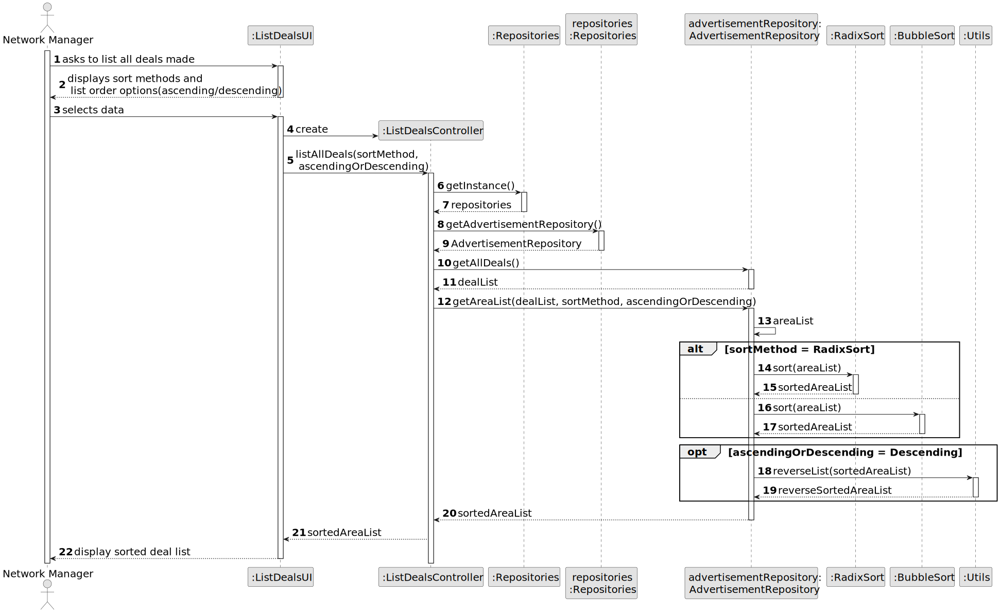
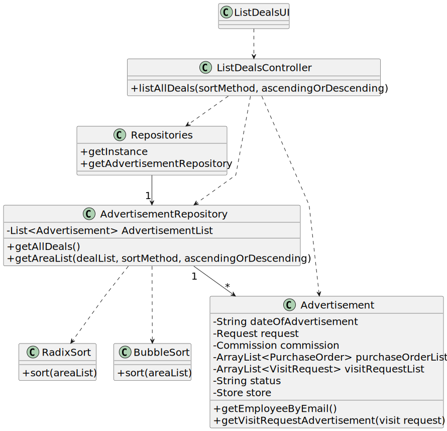

# US 017 - List deals made

## 3. Design - User Story Realization 

### 3.1. Rationale

**SSD - Alternative 1 is adopted.**

| Interaction ID | Question: Which class is responsible for...                                     | Answer                  | Justification (with patterns)                                                                                 |
|:---------------|:--------------------------------------------------------------------------------|:------------------------|:--------------------------------------------------------------------------------------------------------------|
| Step 1  		     | 	... interacting with the actor?                                                | ListDealsUI             | Pure Fabrication: there is no reason to assign this responsibility to any existing class in the Domain Model. |
| 			  		        | 	...  coordinating the US?                                                      | ListDealsController     | Controller : Controls the sequence of events                                                                  |
| Step 2  		     | 		...displaying sort methods and list order options(ascending/descending)?					 | ListDealsUI             | IE: is responsible for user interactions.                                                                     |
| Step 3  		     | 	...getting all deals?                                                          | AdvertisementRepository | IE: owns all advertisements and their status(example: "Validated").                                           |
| 		             | 	...getting deals areas?                                                        | Advertisement           | IE: is responsible for its owns data .                                                                        |
| 		             | 	...sorting the deals areas?                                                    | RadixSort/BubbleSort    | IE: are responsible for sorting functions                                                                     |
| 		             | 	...ordering the deals by ascending or descending                               | Utils                   | IE: possesses functions to do this step                                                                       |
| Step 4  		     | 	...displaying the deals list ?                                                 | ListDealUI              | IE: is responsible for user interactions.                                                                     |

### Systematization ##

According to the taken rationale, the conceptual classes promoted to software classes are:

* Advertisement

Other software classes (i.e. Pure Fabrication) identified: 

 * ListDealsUI  
 * ListDealsController
 * AdvertisementRepository
 * RadixSort
 * BubbleSort

## 3.2. Sequence Diagram (SD)

### Full Diagram

This diagram shows the full sequence of interactions between the classes involved in the realization of this user story.

## 3.3. Class Diagram (CD)

