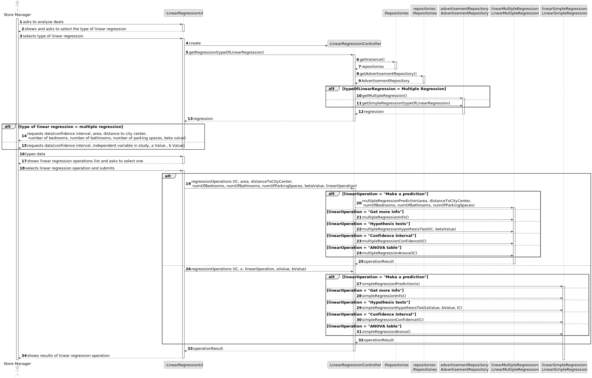
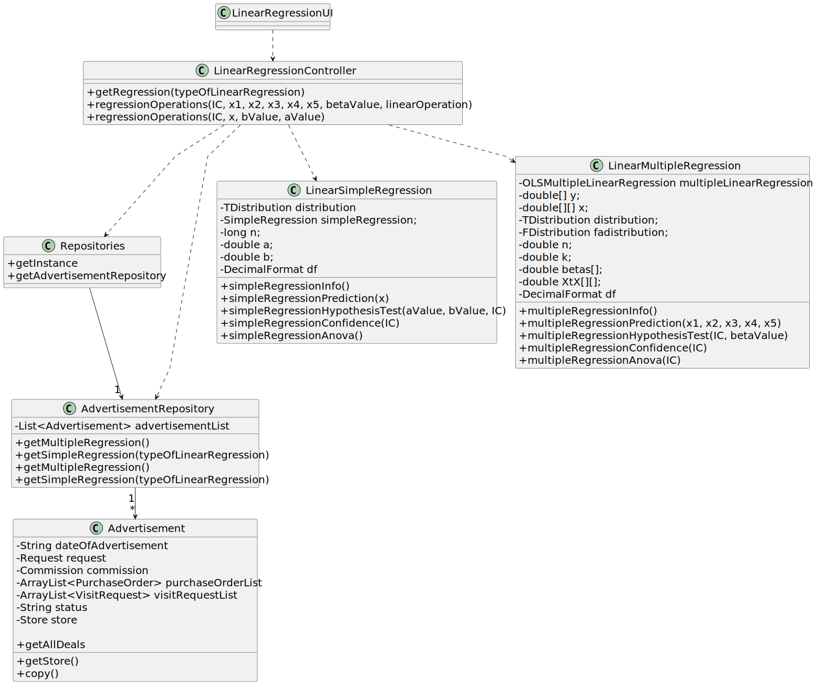

# US 018 - Analyse deals

## 3. Design - User Story Realization 

### 3.1. Rationale

**SSD - Alternative 1 is adopted.**

| Interaction ID | Question: Which class is responsible for...            | Answer                                          | Justification (with patterns)                                                                                 |
|:---------------|:-------------------------------------------------------|:------------------------------------------------|:--------------------------------------------------------------------------------------------------------------|
| Step 1  		     | 	... interacting with the actor?                       | LinearRegressionUI                              | Pure Fabrication: there is no reason to assign this responsibility to any existing class in the Domain Model. |
| 			  		        | 	...  coordinating the US?                             | LinearRegressionController                      | Controller : Controls the sequence of events                                                                  |
| Step 2  		     | 		...displaying types of linear regressions					       | LinearRegressionUI                              | IE: is responsible for user interactions.                                                                     |
| Step 3  		     | 	...creating the linear regressions                    | AdvertisementRepository                         | Creator: owns all advertisements which have the information necessary to create the regressions               |
| Step 4  		     | 	...requesting data?                                   | LinearRegressionUI                              | IE: is responsible for user interactions.                                                                     |
| Step 5  		     | 	...requesting data?                                   | LinearRegressionUI                              | IE: is responsible for user interactions.                                                                     |
| Step 6         |                                                        |                                                 |                                                                                                               |
| Step 7		       | ...displaying linear regressions operations            | LinearRegressionUI                              | IE: is responsible for user interactions.                                                                     |
| Step 8		       | ...making linear regression operations                 | LinearMultipleRegression/LinearSimpleRegression | IE: are responsible for all linear regression operations.                                                     |
| Step 9		       | ...displaying the linear regression operations results | LinearRegressionUI                              | IE: is responsible for user interactions.                                                                     |

### Systematization ##

According to the taken rationale, the conceptual classes promoted to software classes are:

Other software classes (i.e. Pure Fabrication) identified: 

 * LinearRegressionUI  
 * LinearRegressionController
 * AdvertisementRepository
 * LinearMultipleRegression
 * LinearSimpleRegression

## 3.2. Sequence Diagram (SD)

### Full Diagram

This diagram shows the full sequence of interactions between the classes involved in the realization of this user story.

## 3.3. Class Diagram (CD)

