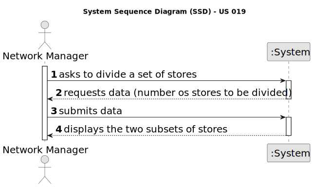

# US 019 - Divide all stores into two close subsets, by properties

## 1. Requirements Engineering

### 1.1. User Story Description

As a network manager, I want to divide the set of all stores into two subsets,
so that the total number of properties of the stores between the two subsets is
the closest possible.

### 1.2. Customer Specifications and Clarifications 

**From the specifications document:**

>  

**From the client clarifications:**

> **Question:** In US019, our team had some doubts regarding the information that is going to be analyzed. According to many MDISC teachers, we are only supposed to process the information within a CSV file chosen by the network manager. However, in the US description and acceptance criteria there isn't any mention of this, implying that we need to use all the information that's registered in our system. This situation also applies to MATCP, seeing the regression models, according to subject teachers, also should be generated using the CSV file information.
Additionally, if it is only supposed to be the CSV file information, can we ask for the file path of it?
>
> **Answer:**  In USs 17, 18 and 19, the network manager and the store manager should be able to explore/analyze ALL deals that are registered in the system.
To develop the work required by MATCP and MDISC courses, you should have a clean/empty system, and you should load the CSV file that is already available in moodle (please the link "CSV file generated by the legacy system to be explored in US17, US18 and US19" available in moodle).

> **Question:** Should the CSV legacy file be used as a file that has the purchase orders that were accepted and therefore be used in the US019 or does the CSV file not contain the type of deals we are looking for?
>
> **Answer:** In USs 17, 18 and 19, the network manager and the store manager should be able to explore/analyze ALL deals that are registered in the system.
To develop the work required by MATCP and MDISC courses, you should have a clean/empty system, and you should load the CSV file that is already available in moodle (please the link "CSV file generated by the legacy system to be explored in US17, US18 and US19" available in moodle).

### 1.3. Acceptance Criteria

* **AC1:** The application should implement a brute-force algorithm, an algorithm
  which consists of calculating all the partitions of cardinal 2 and finding out which
  one is the minimum for the difference of the sum of the elements of each sublist.

* **AC2:** The algorithm should return the sublists of the partition (each sublist should
  contain a set of tuples with two elements each, the storeID and the number of
  properties manage by the store) that satisfies the stated condition and also the
  difference between the sums of the elements of the sublists. In the user manual,
  this algorithm must be written in pseudocode.

* **AC3:** Runtime tests for variable length n input lists, with com n = 3, 6, 9, …, 30
  (asymptotic behavior) should be performed. In each run the number of stores
  should be chosen sequentially. In the user manual, the results of measuring the
  time of each algorithm for one/several inputs of the same size, as also the graphic
  of the asymptotic behavior of the execution time should be presented (use a unit
  of time that allows you to distinguish the running times of all tested examples).
  Also, it should be presented the input list, the two sublists that make up the
  partition and difference of sums, for at least one example of each input size.

* **AC4:** Worst-case time complexity of the algorithm should be documented in the
  application user manual (in the annexes, where algorithms should be written in
  pseudocode) that must be delivered with the application.

### 1.4. Found out Dependencies

* There is a dependency to "US003 : Register new Employees" since to divide the set of all stores into two subsets, the system administrator must first insert the employee into the system.

### 1.5 Input and Output Data

**Input Data:**

* Typed data:

  * Number of stores to be studied

* **Output Data:**

  * (In)Success of the operation

### 1.6. System Sequence Diagram (SSD)

