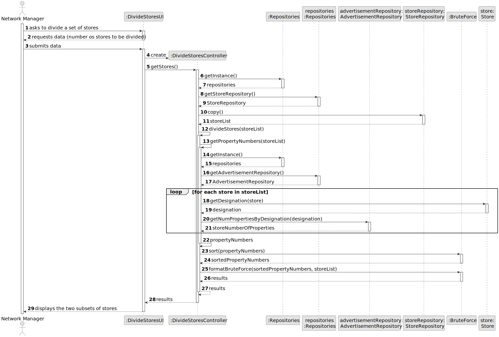
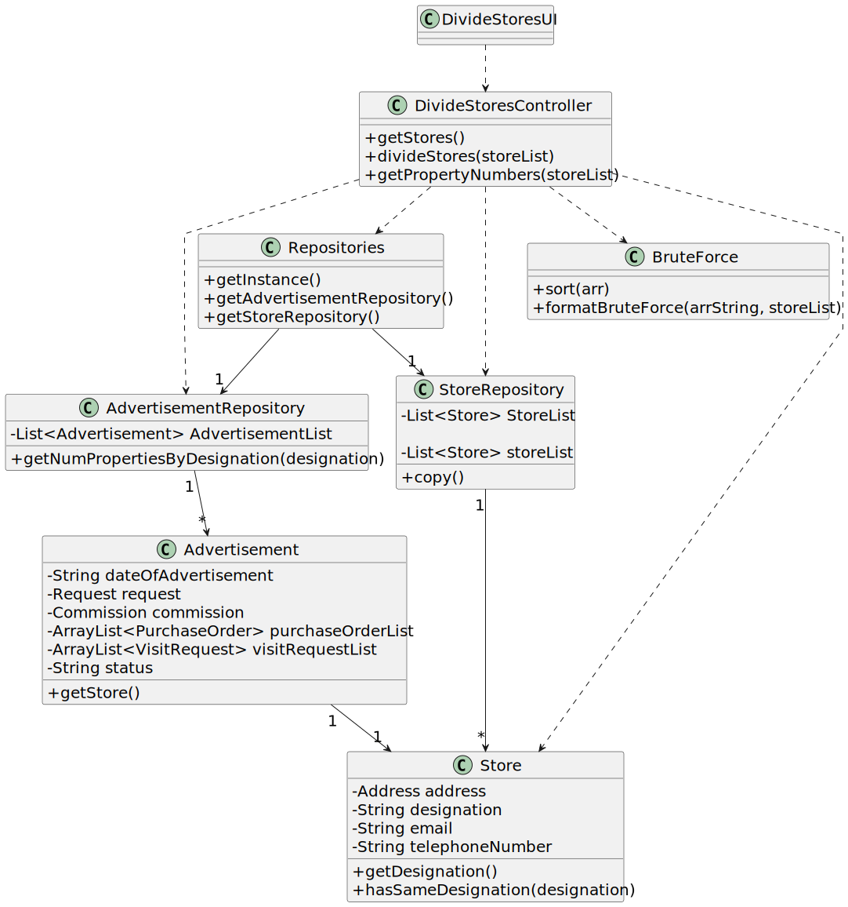

# US 019 - Divide all stores into two close subsets, by properties

## 3. Design - User Story Realization 

### 3.1. Rationale

**SSD - Alternative 1 is adopted.**

| Interaction ID | Question: Which class is responsible for... | Answer                  | Justification (with patterns)                                                                                 |
|:---------------|:--------------------------------------------|:------------------------|:--------------------------------------------------------------------------------------------------------------|
| Step 1  		     | 	... interacting with the actor?            | DivideStoresUI          | Pure Fabrication: there is no reason to assign this responsibility to any existing class in the Domain Model. |
| 			  		        | 	...  coordinating the US?                  | DivideStoresController  | Controller : Controls the sequence of events                                                                  |
| Step 2  		     | 	...requesting data?                        | DivideStoresUI          | IE: is responsible for user interactions.                                                                     |
| Step 3  		     | 	...get all stores?                         | StoreRepository         | IE: owns all stores.                                                                                          |
| 		             | 	...get stores designation?                 | Store                   | IE: is responsible for its owns data.                                                                         |
| 		             | 	...get store's number of properties?       | AdvertisementRepository | IE: owns all advertisements.                                                                                  |
| 		             | 	...divide stores into sets?                | BruteForce              | IE: is responsible for sorting values into sets.                                                              |
| Step 4  		     | 	...displaying the subsets of stores ?      | DivideStoresUI          | IE: is responsible for user interactions.                                                                     |

### Systematization ##

According to the taken rationale, the conceptual classes promoted to software classes are:

* Person
* VisitRequest
* Client
* Agent
* Advertisement

Other software classes (i.e. Pure Fabrication) identified: 

 * VisitRequestUI  
 * VisitRequestController
 * ManageVisitRequest
 * ManageAdvertisement

## 3.2. Sequence Diagram (SD)

### Full Diagram

This diagram shows the full sequence of interactions between the classes involved in the realization of this user story.

## 3.3. Class Diagram (CD)

